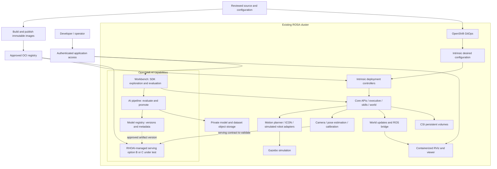

# Intrinsic Core on ROSA and OpenShift AI: analysis and work plan

**Date:** 2026-10-01, updated 2026-10-02 after the hybrid feasibility review.
**Status:** full OpenShift deployment selected; this is a planning document, not
an implementation or a claim that deployment has succeeded. No full
Intrinsic-on-OpenShift deployment has been attempted.
[Deployment journal](README.md) · [Current pod reference](PODS_README.md) · [Demo results](DEMO_README.md)
[Deployment approaches](approaches/README.md) · [Archived hybrid experiment](approaches/tried-not-feasible-aws-vm-with-rhoai/README.md)

## 1. Recommendation

Target an existing GPU-capable **OpenShift** cluster, likely ROSA, after
confirming the target, product versions, and available capacity.
First reproduce the working Intrinsic simulation as native OpenShift workloads.
Then integrate the perception model lifecycle with **Red Hat OpenShift AI
(RHOAI)** on that cluster.

OpenShift AI is an additional platform on OpenShift: placing a Deployment in an
AI project alone does not turn it into an AI-managed serving workload. The
integration must use appropriate serving, workbench, registry, or pipeline APIs.

There are two separate deliverables:

1. **Simulation parity:** Intrinsic Core, the `lab_bb_01` simulated workcell,
   GPU-backed inference, and the RViz view work on ROSA.
2. **Red Hat AI integration:** a validated OpenShift AI serving integration,
   reproducible perception evaluation, and versioned model promotion are connected
   to that workcell without changing its external behavior.

The strongest immediate AI candidate is the **inference wrapper + Triton pair**.
Robot control, Gazebo, the executive, skills, and the world model initially remain
ordinary OpenShift application workloads. Workbenches and AI pipelines can add
value alongside them without taking over robot execution.

This is feasible enough to justify a migration spike, but **not a demonstrated
drop-in migration**. Direct containerd integration and local IPC are the first
go/no-go questions.

## 2. What we have actually proved

| Area | Observed baseline | Still unproven |
| --- | --- | --- |
| Platform | Ubuntu Server, K3s, one GPU-equipped AWS VM; release `20260922.0` of Core and OMTS | OpenShift admission, CRI-O, ROSA policies, and multiple-worker behavior |
| Deployment | 51 ready pods across the namespaces in the pod reference | Equivalent application behavior on ROSA; 51 is not a target OpenShift pod count |
| GPU | One NVIDIA T4, with 48 advertised time-sharing slots; the demo advanced through camera capture and pose estimation | Quantitative model accuracy, latency, and capacity under a representative workload |
| Visualization | Live RViz workcell view; Gazebo simulation backend | Containerized viewer on OpenShift |
| Application | Local API responding; ICON enabled; simulated pick, transfer, placement, and unload actions executed | Completed machine-tending cycle: retries stopped on a workpiece/enclosure collision during unloading |
| Recovery | Existing VM recovered after stop/start and the documented device-plugin fix | OpenShift rescheduling, storage reattachment, or high availability |

We have now run bounded, one-cycle simulation attempts. A missing gripper command
handler was recovered by recreating its simulated driver pod. Subsequent runs
demonstrated perception and motion but stopped on a repeatable workpiece/enclosure
collision during unloading, including after a world reset. See the
[demo runbook](DEMO_README.md). **No complete cycle has passed.**

Use the successful intermediate steps as reproducible platform checks, and track
the existing simulation failure separately. A full-cycle pass remains an
acceptance goal; reproducing the existing failure does not satisfy that goal.

## 3. Target assumptions and prerequisites

The cluster for the full deployment still needs confirmation. dev01 is a
candidate based on prior work, but the hybrid experiment did not validate full
simulation capacity or policy there. dev02 inventory and hybrid smoke results
do not establish full-deployment readiness. Re-inventory the selected target's
versions, capacity, and policy before planning workloads. Resource capacity and
policy can change:

| Input | Planning assumption / item to confirm |
| --- | --- |
| ROSA topology | Confirm target cluster, classic versus hosted control planes, and application administration permissions |
| OpenShift and AI releases | Re-run preflight on the selected target for OpenShift, RHOAI, and KServe versions. Verify the exact compatibility entry before implementation. |
| Architecture | Start with x86-64 workers to match our current Linux amd64 artifacts |
| GPU | An A10 was selected for the dev01 gRPC smoke, but full-deployment capacity, quota, and remaining VRAM are unverified. Inventory the selected target; do not infer full-deployment capacity from a smoke test. |
| CPU and RAM | Measure incremental allocatable capacity on the selected target after existing tenants and platform services; VM sizing is not OpenShift cluster sizing |
| Storage | Re-inventory the selected target StorageClasses and confirm access mode, topology, snapshots, quota, and approved object storage; do not copy dev02 StorageClass assumptions |
| Registry | Approved private OCI registry reachable by every worker; choose existing registry or Quay with the platform team |
| Networking | Private service connectivity, an approved viewer ingress path, DNS, gRPC, and access to required registries |
| Governance | Confirm project/namespace allocation, service accounts, scoped RBAC, SCC policy, and any exception approvals on the selected target. |
| OpenShift AI | Re-inventory RHOAI/KServe on the selected target; confirm entitlement, enabled serving runtime, and release-specific dependencies. |

The [RHOAI 3.x compatibility matrix](https://access.redhat.com/articles/rhoai-supported-configs-3.x)
must be checked against the versions actually installed on the selected target.
dev02's version pairing is not evidence of compatibility with the target. This
is a planning check, **not an instruction to upgrade**. Use the selected
target's corresponding matrix and APIs.

Use existing ROSA platform services and Operator-managed GPU integration. Do not
run the Ubuntu `setup_k3s.sh` or `setup_nvidia.sh` installers on OpenShift nodes.
The [OpenShift architecture](https://docs.redhat.com/en/documentation/openshift_container_platform/4.20/html/architecture/architecture)
uses CRI-O; changing a containerd socket path to a CRI-O socket does not make
Intrinsic's containerd client compatible.

## 4. Proposed architecture

Keep RHOAI platform namespaces distinct from application projects, include the
OMTS application client in the system view, and distinguish measured resource
use from unvalidated capacity estimates. Proposed application namespaces such
as `intrinsic-ops`, `intrinsic-ai-dev`, and `intrinsic-ai-serving` are design
choices requiring validation, not upstream defaults. The local architecture
deck and review files are intentionally excluded from Git while under review.

This diagram shows the intended integration. The AI serving box is conditional on
the interface spike in section 7; until that passes, the inference pair stays in
the Intrinsic resource deployment.



Preserve the current application namespaces initially if they are available on
the target. Some DNS names are compiled into the source. Use a dedicated AI
project for experiments and serving. Parameterizing all namespace references is
a separate task if existing ROSA tenancy requires different names.

## 5. Component placement

This mapping covers the existing workload groups. It supplements, rather than
duplicates, the complete 51-pod reference.

| Current component(s) | First OpenShift placement | OpenShift AI opportunity / boundary |
| --- | --- | --- |
| `executive`, all eight `skill-group-*` pods | Application Deployments/Services with corrected security contexts | Keep behavior-tree and robot-action execution here; AI pipelines do not replace skills |
| `world`, `world-updater`, `geomservice`, `scene-object-import` | Application services with CSI-backed state where needed | Supply scene/geometry data to evaluation workflows; not generic model servers |
| `resource-registry`, `skill-registry`, `proto-registry`, `proto-builder` | Preserve Intrinsic discovery and type APIs | RHOAI model registry does not replace any of these registries |
| `operations`, `solution-service`, `workcell-cluster-service` | Preserve application lifecycle services | Connect deployment status to operations dashboards |
| `artifacts-deployment`, `data-store`, `runtime-db`, `kvstore-service` | Adapt image distribution and persistence; retain application APIs | Model artifacts may be published to AI storage through an explicit adapter; S3 is not a drop-in CAS/database replacement |
| `http-gateway`, `zenoh-router` | Private application networking, with the required TCP/UDP paths evaluated separately | Network bridge between robot application and AI services |
| `simulation-service`, `gzserver`, `rs-gazebo-simulator-0` | Application simulation services; preserve the proxy/simulator distinction | Generate controlled evaluation inputs; no reason to wrap Gazebo in KServe |
| `rs-icon-0`, `rs-ur-module-0`, `rs-motion-planner-service-0` | Keep near the simulator; resolve IPC, scheduling, and capability requirements first | Stay outside ML training/serving orchestration |
| `rs-gripper-0`, `rs-hande-gripper-0`, both Orbbec pods | Simulated hardware adapter services | Camera output can feed AI evaluation; preserve sim mode and remove unnecessary device privileges |
| `rs-flowstate-ros-bridge-0` | Application ROS bridge | Feeds RViz; independent of AI model serving |
| `rs-calibration-service-0` | Application service | AI pipelines may call it for repeatable evaluation preparation; retain its API |
| `rs-pose-estimator-service-0` | Keep with the application initially | Candidate for a later custom perception runtime, after tracing all world/camera/data dependencies |
| `rs-inference-service-0` (two containers) | Preserve wrapper and Triton together for native parity | Compare a custom paired `ServingRuntime`/`InferenceService` with a RHOAI Triton endpoint and Intrinsic client changes; neither is selected or validated |
| `rs-train-service-0` | Keep the existing registration/preparation API | Pipeline jobs can invoke it; its name does not establish neural-network training capability |
| `code-execution` (including its Jupyter container) | Preserve the application runtime and its internal interfaces | Add a separate developer workbench; do not replace the embedded Jupyter service merely because both use notebooks |
| `istiod`, `istio-ingressgateway` | Reconcile routing with the platform team's mesh/ingress design | Do not install a conflicting Istio control plane or overwrite AI-managed mesh resources |
| `chart-assignment-controller` | Retain initially, with reviewed CRDs and RBAC | GitOps manages its inputs; do not make GitOps and this controller own the same generated resources |
| K3s CoreDNS, metrics, local-path provisioner, `svclb-*` | Use OpenShift platform equivalents; omit K3s infrastructure manifests | These are cluster services, not ML workloads |
| Standalone NVIDIA device plugin | Use the existing approved GPU Operator/device-plugin integration | Shared infrastructure for inference, workbenches, and jobs |
| VM viewer service (not currently a pod) | Containerized RViz/noVNC application with private access | Separate visualization workload; optional workbench integration later |

## 6. Concrete migration blockers found in our deployment

The observations below came from read-only inspection of live pod specifications,
PVCs, Services, and the pinned upstream source. No raw cluster export, Secret,
environment dump, or private address is included here.

| ID | Verified observation | Required work / test |
| --- | --- | --- |
| B1 | `artifacts-deployment` mounts `/run/k3s/containerd/containerd.sock` and exposes a host port. The chart executable constructs a `ContainerDPublisher`. | Use registry-backed distribution across workers and remove runtime-socket access. Verify both initial platform installation and later solution/asset deployment. |
| B2 | Many services and all skill groups request UID/GID `65532`; embedded Jupyter requests `1000`. | Test arbitrary namespace-assigned UIDs, filesystem ownership, writable directories, and group permissions. Correct source templates/images rather than editing live pods. |
| B3 | Hand-E simulation driver is privileged; ICON adds `SYS_NICE` and `IPC_LOCK`; UR module adds `IPC_LOCK`; motion planner adds `SYS_RAWIO`. | Determine which are actually required in simulation. Remove unnecessary privileges; document narrowly scoped service-account/SCC exceptions only if essential and permitted. |
| B4 | Gazebo, ICON, and the UR module share `/tmp/intrinsic_icon` through host paths. Gazebo also uses a host mesh directory. | Trace socket/shared-memory/file semantics and required placement. Test a shared-pod design or a deliberately colocated arrangement; determine whether source changes are needed. A network PVC is not a replacement for local IPC. |
| B5 | `data-store` mounts `/var/apps/intrinsic-db`; four PVCs use K3s local storage classes. | Move durable files to suitable CSI volumes; classify ephemeral caches separately; prove restart and restore behavior. |
| B6 | Inference wrapper and Triton share `/models`, memory-backed `/dev/shm`, a Unix socket, and explicit model load/unload operations. | Keep the pair colocated for parity. An independently deployed Triton endpoint requires adapter changes, not just a new Service name. |
| B7 | Source contains an explicit `app-intrinsic-base` CAS DNS name; live services include Istio, Zenoh TCP, and an HTTP gateway UDP NodePort. | Preserve or parameterize DNS/routing contracts; establish protocol-by-protocol network policy. Do not assume an HTTPS Route transports raw TCP or UDP. |
| B8 | Cloud Robotics `ChartAssignment` and `ResourceSet` CRDs are installed. Intrinsic services generate resources dynamically. | Inventory watched namespaces, CRDs, RBAC, ownership, generated security contexts, and reconciliation behavior. Static manifest edits alone will not survive redeployment. |
| B9 | Many application containers have no CPU/memory requests; Gazebo has a `12Gi` limit with a zero memory request. | Measure demand and set realistic requests/limits before shared-cluster scheduling. Account for memory-backed volumes as well. |
| B10 | The viewer is a VM systemd service; it relies on ROS, X11, software OpenGL, private Unix sockets, and SSH. | Package a non-root container with writable runtime directories; select private port-forwarding or authenticated TLS/WebSocket ingress. |

All 70 inspected application/infrastructure containers use `IfNotPresent`, not
`Never`. The image portability problem is how images reach the runtime, not an
observed `Never` policy. Prove a pull on a worker without a preloaded image cache.

### B1: reuse available registry code before writing a replacement

The [chart executable](https://github.com/intrinsic-ai/intrinsic-core/blob/20260922.0/intrinsic/kubernetes/chart_executable.go)
selects containerd directly. However, the
[artifact service](https://github.com/intrinsic-ai/intrinsic-core/blob/20260922.0/intrinsic/storage/artifacts/artifacts_service.go)
already has a registry-backend branch, and the
[image publisher](https://github.com/intrinsic-ai/intrinsic-core/blob/20260922.0/intrinsic/production/image_publisher.go)
contains registry publishing code. Investigate these extension points first.

The spike must establish authentication and registry compatibility, digest
references, generated image names, and asset upload/download behavior. Existing
code is evidence of a possible implementation path, not proof that Quay/ROSA
works without changes. Keep image publishing credentials separate from runtime
pull credentials and inject them through approved secret management.

### B2–B4: security and local IPC are coupled

Target the cluster's restricted SCC policy and SELinux enforcement. OpenShift
[SCCs](https://docs.redhat.com/en/documentation/openshift_container_platform/4.22/html/authentication_and_authorization/managing-pod-security-policies)
constrain UIDs and host access. Read-only root filesystems alone do not establish
compatibility. Test image startup, model downloads, shared memory, and socket
permissions under the actual admitted identity.

Start by removing privileges that the simulation does not need. Where requirements
remain, review one service account at a time with the ROSA administrators. If
required host access is unavailable, the project needs a packaging/IPC refactor;
granting blanket `privileged` or `anyuid` to the project is not the proposed fix.

The initial simulation may need Gazebo/ICON/UR colocated. Make that requirement
explicit. No node selector was present on the inspected resource pods, so their
working placement on a single VM does not prove multi-node scheduling correctness.
Do not claim seamless failover for a node-bound IPC arrangement.

### B5: storage inventory and disposition

| Current claim / path | Observed size and mode | Proposed disposition |
| --- | --- | --- |
| `onprem-cas` | `10Gi`, RWO, `local-path` | CSI RWO volume initially; preserve CAS semantics |
| `runtime-db-claim` | `100Mi`, RWO, `local-path` | CSI RWO volume; size from measured growth and backup requirements |
| `world-storage-claim` | `100Mi`, RWO, `local-path` | CSI RWO volume; validate UID/SELinux permissions and recovery |
| `zenohd-storage-v2` | `10Gi`, RWX, `local-storage` | Determine actual writer count. Use supported RWX storage if required, or deliberately change to RWO if single-writer semantics permit |
| `/var/apps/intrinsic-db` | Host directory | Classify contents and migrate durable state to a PVC |
| Gazebo mesh directory | Host directory | Consider image assets, init-container materialization, or a PVC based on write/access semantics |
| `/tmp/intrinsic_icon` | Shared host directory | Resolve IPC independently; not an S3 or generic RWX migration |
| Inference `/models` and `/dev/shm` | Pod-local ephemeral volumes | Preserve together initially; rebuild model state deterministically after restart |

The existing RWX declaration on one VM does not demonstrate distributed RWX
storage. On AWS, assess the approved block CSI class for RWO and the available
shared filesystem only where needed. Keep volumes and workloads compatible with
availability-zone placement. Retain the original VM as the reference; prefer a
clean deployment of the same solution before migrating any evaluation state.

## 7. OpenShift AI integration design

### 7.1 Inference serving: separate RHOAI capability from Intrinsic integration

The pinned [inference manifest](https://github.com/intrinsic-ai/intrinsic-core/blob/20260922.0/intrinsic_inference/assets/inference_service/inference_service.manifest.textproto)
deploys two containers sharing model files and memory, with Triton listening on a
Unix socket. The [entry point](https://github.com/intrinsic-ai/intrinsic-core/blob/20260922.0/intrinsic_inference/assets/inference_service/inference_service_main.py)
hard-codes that socket, enables shared memory, and connects to Intrinsic assets
and CAS. The [controller](https://github.com/intrinsic-ai/intrinsic-core/blob/20260922.0/intrinsic_inference/core/model_controller_triton.py)
issues model load/unload requests.

RHOAI's single-model serving platform uses KServe `ServingRuntime` and
`InferenceService` resources. Its current
[support matrix](https://access.redhat.com/articles/rhoai-supported-configs-3.x)
lists NVIDIA Triton as **tested and verified** in Standard (Raw) mode, with gRPC
as the default protocol and REST as an additional protocol. The version-specific
[RHOAI 3.4 serving documentation](https://docs.redhat.com/en/documentation/red_hat_openshift_ai_self-managed/3.4/html/configuring_your_model-serving_platform/configuring_model_servers)
defines `ServingRuntime` and `InferenceService`; the support matrix lists Triton
in a separate **Tested and verified** category, outside its **Supported
model-serving runtimes** table. Confirm the applicable support scope for the
exact target version, mode, and intended use. The Triton entry does not certify
Intrinsic's wrapper, images, models, or this integration. RHOAI 3.4.1 was
observed on dev02 only; dev01's installed release and managed KServe setup must
be inventoried before selecting version-specific instructions. The Triton
runtime and workload integration must be validated before simulation use.

The documented RHOAI single-model platform creates a dedicated model server for
each model and exposes inference over the serving API. The Intrinsic deployment
currently runs a wrapper and Triton together, shares model files and `/dev/shm`,
uses a Unix socket between them, and reconciles model load/unload through the
Intrinsic controller. Do not equate an RHOAI Triton endpoint with that existing
two-container service contract. In particular, prove the wrapper's external
protocol, the KServe gRPC/REST contract, the number of models/endpoints required,
and which system owns artifact staging and model lifecycle.

| Option | Implementation | Decision |
| --- | --- | --- |
| A. Preserve the current pair | Adapt its StatefulSet/resource deployment for OpenShift; keep shared volumes and socket | Native OpenShift parity baseline; not RHOAI-managed serving |
| B. Custom paired RHOAI runtime | Test whether a user-maintained `ServingRuntime` can place the Intrinsic wrapper and Triton in one serving pod and expose the wrapper's protocol through KServe | Conditional hypothesis. Verify target KServe support for the multi-container pod, health/port routing, model count and lifecycle, and Intrinsic dependencies. No Red Hat support for the custom integration is assumed. |
| C. RHOAI Triton endpoint with an Intrinsic client change | Use the listed Triton runtime/serving API; adapt the Intrinsic client path and model/artifact lifecycle for remote endpoint(s) | Comparative hypothesis. Requires replacing local socket/shared-memory assumptions and deciding how KServe-owned model versions map to Intrinsic's dynamic model/resource contract. |

First use a minimal Triton model to verify the target RHOAI serving platform,
artifact access, GPU placement, and client connectivity. This is a platform
smoke test only; it is not an Intrinsic integration or a model-compatibility
result. Then compare B and C against the exact pinned pose-estimation model set
and source contract. For B, verify whether the wrapper speaks the protocol that
the target `InferenceService` exposes, and test container ordering, local socket
and shared-memory permissions, probes, UID constraints, GPU allocation, and
resource registration. For C, verify endpoint protocol compatibility, remote
latency, and how the complete model set and version changes are provisioned.

For the full OpenShift design, map service-to-service calls, DNS, storage, and
identity within the cluster before changing network rules. Preserve the
DataAssets/CAS, resource-registration, and controller dependencies when placing
the wrapper and model server. If RHOAI-managed serving is selected, use its
approved in-cluster endpoint and identity flow; do not expose Triton's
administrative model-management API to general clients. Keep the native
inference pair available as the parity baseline until a RHOAI-managed pattern
passes the gated simulation test.

Treat endpoint exposure as a separate security gate. RHOAI's KServe deployment
documentation warns that a model endpoint can be exposed outside the cluster
without authentication by default. Verify the actual route, reachability,
authentication, TLS trust, and network policy before sending application input;
keep the endpoint private or apply the cluster-approved authentication and
source restrictions. Runtime inference does not require exposing the
Kubernetes API.

Begin with one warm replica in the target-supported mode. Do not enable
scale-to-zero, automatic replica growth, canary traffic, or model rollout until
model reload, mutable state, startup time, endpoint routing, and required GPU
headroom are measured. If neither B nor C preserves the application contract,
keep A and use workbenches/pipelines first; record serving integration as
unfinished rather than relabeling an ordinary Deployment as an AI-managed port.

The current models are computer-vision components (RF-DETR and FoundationPose,
named in the [pose configuration](https://github.com/intrinsic-ai/intrinsic-omts/blob/20260922.0/configs/common/pose_estimator_config.textproto)).
Replacing them with an LLM-serving runtime is not part of this migration.

### 7.2 Workbenches

Create a separate developer workbench containing compatible Intrinsic Python
SDKs, evaluation code, and plotting tools. Use it for scene inspection, recorded
RGB-D inputs, pose visualization, and controlled calls to application APIs.
Keep its permissions and GPU quota distinct from the robot runtime.

Validate a [custom workbench image](https://docs.redhat.com/en/documentation/red_hat_openshift_ai_self-managed/3.4/html/managing_openshift_ai/creating-custom-workbench-images)
against the SDK's Python and native-library requirements. Preserve the embedded
application Jupyter/code-execution service until its runtime contract is separately
understood. Adding a workbench is useful even before inference extraction succeeds.

### 7.3 AI pipelines and model lifecycle

Build a reproducible pipeline: approved dataset/geometry → registration or model
preparation → optional actual training/export → target-GPU engine build if needed
→ offline evaluation → version registration → reviewed promotion → simulated
application regression → rollback or acceptance.

The existing [train-service tool](https://github.com/intrinsic-ai/intrinsic-omts/blob/20260922.0/tools/pose_estimation/register_using_train_service.py)
registers/sideloads pose-estimation assets. Initially wrap that operation as a
pipeline step. Do not claim a training pipeline exists simply because the service
is named `train-service`. Actual fine-tuning is a separate extension requiring
datasets, training code, evaluation criteria, and compute.

Use [AI pipelines](https://docs.redhat.com/en/documentation/red_hat_openshift_ai_self-managed/3.4/html/working_with_ai_pipelines/managing-ai-pipelines_ai-pipelines)
for repeatable experiments and artifact lineage. Use a
[model registry](https://docs.redhat.com/en/documentation/red_hat_openshift_ai_self-managed/2.25/html-single/working_with_model_registries/index)
for model/version metadata; keep model bytes in approved object/OCI storage.
The linked registry overview explains the concept; implement against the target
release's API. Define an explicit mapping between registry versions and Intrinsic
asset IDs so both systems agree on the model being served.

Record dataset version, object geometry, camera calibration, preprocessing,
runtime/image digest, GPU type, engine build parameters, and evaluation results.
These together determine repeatability; a weight file alone is insufficient.
Pipelines perform bounded simulation tests and must not automatically command
physical equipment.

### 7.4 GPU strategy

Reserve an exclusive GPU allocation for the first inference comparison if the
cluster permits it. Keep workbench experiments and training from competing with
the baseline run. With only one usable GPU, schedule these activities serially.
Introduce sharing only after measuring memory headroom and latency under load.

The VM's 48 advertised slots represent one physical GPU, not 48 GPUs or isolated
memory partitions. NVIDIA documents that
[time slicing](https://docs.nvidia.com/datacenter/cloud-native/openshift/latest/time-slicing-gpus-in-openshift.html)
does not provide memory/fault isolation. Preserve neither that replica count nor
the VM driver version by default; use the target's validated Operator stack.

Confirm [GPU Operator platform support](https://docs.nvidia.com/datacenter/cloud-native/gpu-operator/latest/platform-support.html).
If ROSA uses a different GPU, verify any TensorRT engine compatibility and rebuild
engines when required; [serialized engines are hardware/version dependent](https://docs.nvidia.com/deeplearning/tensorrt/latest/getting-started/support-matrix.html).
Do not substitute a new model or preprocessing pipeline during platform parity.

## 8. Networking, viewer, and tenancy

- Keep Core, inference, databases, and Zenoh private by default. Begin with
  authenticated Kubernetes port-forwarding for developer access, then add only
  the approved application ingress paths.
- Audit Istio virtual services and gRPC routing before choosing a compatible
  platform-managed mesh or an application gateway. An OpenShift Route is not a
  drop-in replacement for all existing Istio configuration. Verify HTTP/2 and
  end-to-end TLS behavior against the installed ingress version.
- Treat Zenoh TCP and the observed gateway UDP service separately from HTTP.
  Prove which are needed for this simulation; avoid exposing unused ports.
- Apply service-account RBAC and network policies for the actual graph, including
  DNS, Core APIs, registry pulls, CAS, model storage, viewer/ROS, and observability.
- Containerize RViz with software rendering first to match the existing view.
  Keep VNC/X11 private and permit browser access only through an authenticated
  TLS/WebSocket endpoint or a private port-forward. The current local viewer uses
  no separate VNC password because private sockets and SSH provide access control;
  copying it behind an unauthenticated public Route would remove that protection.
- Keep credentials, private certificates, kubeconfigs, account identifiers,
  cluster URLs, private registry/bucket names, and diagnostic exports out of Git.
  Use placeholders and approved external secret handling in implementation files.

## 9. Red Hat value and how to demonstrate it

| Capability | Proposed value | Evidence to collect |
| --- | --- | --- |
| ROSA / OpenShift | Managed platform lifecycle and consistent application deployment | Repeatable install in dedicated projects with documented privileges and resource budgets |
| OpenShift security and tenancy | Scoped access and enforceable workload boundaries | SCC admission, RBAC/negative access tests, network-policy tests, no runtime-socket dependency |
| OpenShift GitOps | Reviewed desired configuration, drift detection, controlled rollback | Reconcile a clean installation and roll back a tested application revision |
| Approved registry / optional Quay | Reproducible image promotion and vulnerability review | Digest inventory, scan results, and worker cache-miss pull test |
| OpenShift AI workbenches | Reusable development and evaluation environment | A second authorized developer reproduces the perception experiment |
| OpenShift AI serving | Managed inference lifecycle and visibility | AI-managed endpoint passes the same input/output tests as the original inference pair |
| OpenShift AI pipelines and registry | Versioned, repeatable evaluation and promotion | Model version traces to inputs, metrics, runtime digest, and simulated regression results |
| GPU Operator and monitoring | Controlled GPU scheduling and measurable utilization | GPU allocation plus utilization/memory/latency measurements during the demo |
| Platform monitoring and storage | Observable failures and recoverable persistent state | Alerts, restart recovery, backup/restore exercise, and documented recovery limits |

Use [OpenShift GitOps](https://docs.redhat.com/en/documentation/red_hat_openshift_gitops/1.21/html/understanding_openshift_gitops/about-redhat-openshift-gitops)
to own platform/application configuration and Intrinsic controller inputs.
Retain Intrinsic ownership of generated resources initially; partition ownership
explicitly to avoid two reconcilers repeatedly overwriting each other.

Additional products are optional and depend on existing entitlements. This plan
does not require installing every Red Hat AI component or purchasing a new stack
to demonstrate platform parity.

## 10. Phased execution plan

Owners below describe skills/teams, not assigned individuals. No phase is already
completed unless explicitly marked; the existing VM supplies the reference.

| Phase | Work and concrete deliverable | Lead | Exit gate |
| --- | --- | --- | --- |
| P0 — Baseline and cluster fit | Confirm target inputs; record source/image digests and sanitized baseline; define a repeatable camera/pose fixture and bounded simulation test | Robotics + platform | Supported target combination, capacity/storage decisions, agreed parity criteria |
| P1 — Portability spikes | Test B1 registry publishing and B2–B4 SCC/IPC with representative services; trace generated-resource ownership | Platform + robotics | No mandatory containerd socket; viable identity/IPC design accepted for ROSA |
| P2 — Native OpenShift deployment | Produce versioned overlays/source patches, registry configuration, RBAC, storage, requests/limits, and protocol routing; deploy unchanged solution semantics | Platform | Core API, resource discovery, skills, GPU inference, simulator, and world all healthy |
| P3 — Visible and functional parity | Package viewer; reproduce RViz scene; run agreed simulated perception/motion regression; test restart/recovery | Robotics + platform | Baseline visual/API parity plus separately recorded functional test results |
| P4 — OpenShift AI integration | Verify target RHOAI Triton serving with a minimal model; compare options B and C against the pinned Intrinsic model/API contract; provide SDK workbench; preserve fallback inference deployment | ML + robotics | One RHOAI-managed path passes the real model, API, lifecycle, security and latency gates, or serving is recorded as blocked while workbench/pipeline value is demonstrated separately |
| P5 — Model lifecycle and operations | Add evaluation pipeline and registry mapping, reviewed promotion, monitoring, backup/restore, and GitOps ownership | ML + platform | Reproduce, promote, and roll back a model/application combination with auditable results |

**Critical path:** registry distribution → permitted identity/IPC → native parity
→ inference-serving integration. Workbench and offline pipeline development can
proceed alongside P2/P3 once access is available. Do not combine a model upgrade,
ROS upgrade, GPU sharing change, and platform migration into one experiment.

Time estimates would be speculative until P1 establishes how much upstream
refactoring is needed. Estimate the remaining work after the registry and IPC
spikes, rather than treating this as a manifest-only migration.

## 11. Acceptance tests

| Test | Passing evidence |
| --- | --- |
| Image distribution | Required images pull by digest on an eligible worker without the VM's container cache; no host runtime socket mounted |
| Admission and tenancy | All application pods start under documented SCCs/service accounts; any exception is narrow and explicitly accepted |
| Core functionality | API calls, asset/resource/skill discovery, executive, world, and simulation status work without external public access |
| Visible parity | Same `lab_bb_01` geometry/frames visible in RViz; ROS bridge updates continue |
| GPU inference | Expected models become ready and process the agreed inputs; GPU use is observed, not inferred from pod readiness |
| Perception parity | Fixed RGB-D/geometry/calibration inputs give comparable detections and 6D poses within tolerances defined in P0 |
| Motion regression | A bounded, simulation-only sequence completes and world/robot state updates agree; resolve or explicitly scope the existing unload collision rather than counting it as a pass |
| Performance | Compare warmed p50/p95 latency, errors, throughput, CPU/RAM/VRAM, model-load time, and simulation real-time factor; agree budgets from measured baseline |
| Failure handling | Model-serving outage produces an explicit application error; recovery reloads the expected model version without silent substitution |
| Persistence | Documented persistent state survives pod restart; restore from backup is exercised; ephemeral simulation state is identified |
| Placement | Required colocated components stay together; permitted rescheduling preserves correctness; node-bound limitations are documented |
| AI integration | The endpoint is genuinely managed through RHOAI APIs and still satisfies Intrinsic's inference/resource contract |
| Promotion and rollback | A recorded model/runtime/configuration tuple can be deployed and rolled back; controller ownership is stable |
| Security | Viewer authentication and private APIs verified; no credentials, private addresses, or certificates in the published repository |

Pod count and Kubernetes readiness are supporting evidence, not sufficient
acceptance criteria. Do not report physical-robot safety or hard real-time
guarantees from cloud simulation results.

## 12. Risks and decisions to resolve

| Risk / unknown | Response |
| --- | --- |
| Registry code assumes a particular cloud identity or URL layout | Test against the chosen registry early; isolate any publisher/backend changes |
| ROSA policy does not permit required local host access | Refactor IPC/packaging or reconsider that component's placement; do not weaken cluster-wide policy |
| Custom serving runtime cannot preserve dynamic asset loading | Keep native inference; evaluate an adapter or immutable model-bundle workflow |
| Shared GPU or changed GPU architecture changes latency/results | Use controlled allocation, fixed inputs, and appropriately rebuilt engines |
| Namespace or Istio CRDs conflict with existing tenants/AI Operators | Review cluster-scoped ownership before install; parameterize application assumptions |
| Multiple control loops fight over workloads | Define GitOps, Intrinsic, and KServe ownership boundaries before rollout |
| Internal gRPC clients cannot meet chosen authentication/TLS requirements | Identify transport adapters and client configuration work as migration tasks |
| No representative end-to-end baseline exists yet | Establish it on the current simulation before claiming equivalent task performance |

Platform support does not certify the Intrinsic application, model licenses, or a
custom Triton build. Confirm those boundaries separately when presenting the
result as a supported architecture.

Physical deployment is a later scope: device connectivity, network latency,
deterministic scheduling, safety controls, and recovery near equipment require a
separate design. Cloud-hosted inference experiments do not authorize moving a
physical robot's real-time control loop to a remote cluster.

## 13. Planned repository outputs and next action

Only this plan and its README link are delivered now. The following are proposed
implementation outputs, not existing or validated deployment files:

```text
openshift/
  README.md                  # prerequisites, ownership, install/rollback
  overlays/rosa/             # security, registry, storage, networking, placement
  gitops/                    # reviewed desired state and controller boundaries
rhoai/
  serving/                   # validated custom runtime and inference service
  workbench/                 # compatible SDK/evaluation image
  pipelines/                 # evaluation and model-promotion workflows
validation/
  README.md                  # reproducible fixtures, acceptance checks, results
patches/
  ...                        # minimal changes against pinned upstream sources
```

The next implementation action is **P0/P1: a ROSA readiness review and two
bounded spikes—registry-backed deployment and restricted-policy simulation IPC**.
Keep the working VM available as a comparison and rollback reference. New
credentials or cluster access are not required to review this document; obtain
them through the approved private workflow when implementation starts.
