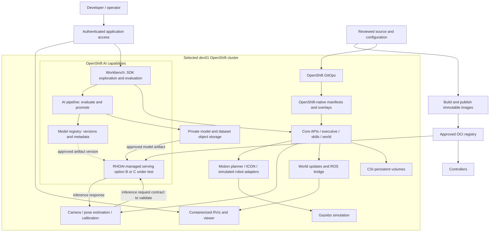

# Intrinsic Core on OpenShift and OpenShift AI: analysis and work plan

**Created:** 2026-10-01 · **Updated:** 2026-10-07
**Status (2026-10-07):** Core and OMTS workloads are applied in
`arhkp-intrinsic`; all four ResourceSets are currently settled. The
`move_to_contact` image fix is deployed: the native PubSub client now targets
the project Zenoh router, and the skill Pod is Ready with zero restarts. That
fix has not passed an actual skill execution. The current run is blocked earlier
in ICON/UR recovery: ICON initially connected to UR and enabled motion, but
after a Gazebo reset the lockstep cycle was cancelled and ICON's reconnect to
`/tmp/intrinsic_icon/ur_module.sock` failed with `Permission denied`. The Pods
are co-located and share the same CephFS claim, fsGroup, and SELinux MCS label.
A read-only inspection found the recreated socket is owned by UID/GID
`1001690000` with mode `0755`; ICON runs as UID 0 and has no group-write access
or `DAC_OVERRIDE` because the OpenShift SCC drops all capabilities. The local
controller/SCC change requests that capability for the exact ICON container,
but it is not yet deployed or verified. One attempted reset also used the
upstream updater's default CNC-cell file list against `lab_bb_01`; three files
were applied before it failed on the absent `cnc_enclosure`. The correct
`lab_bb_01` updates were applied afterward, but the live world may retain extra
CNC-cell frames. No complete OpenShift cycle or viewer pass is verified.
[OpenShift deployment journal](openshift/README.md) · [Current pod reference](PODS_README.md) · [Demo results](DEMO_README.md)
[Deployment approaches](approaches/README.md) · [Archived hybrid experiment](approaches/tried-not-feasible-aws-vm-with-rhoai/README.md)

## Simulator IPC: placement fixed, reset reconnect still failing

The Gazebo HWM and ICON exchange `ur_module` over
`/tmp/intrinsic_icon/ur_module.sock`. Required pod affinity now places ICON,
the UR module, and Gazebo on the same node; the initial ICON-to-UR handshake
succeeded and transferred 48 descriptors. This solved the earlier cross-node
connection refusal, but it did not make reconnection survive a simulator reset.

OpenShift maps upstream's `/tmp/intrinsic_icon` hostPath to the shared
`intrinsic-icon-data` CephFS PVC. After reset, ICON's log records `Permission
denied` on the socket. A read-only mount shows the socket is owned by
`1001690000:1001690000` with mode `0755`. ICON runs as UID 0 with supplemental
group `1001690000`; the OpenShift SCC drops all capabilities, so ICON lacks
`DAC_OVERRIDE` and the shared group has no write bit. The local fix requests
`DAC_OVERRIDE` only on the exact ICON main container; verify its admission and
post-reset reconnect before treating this as resolved. Do not treat Pod
readiness as proof that ICON's realtime loop and HWM are healthy.

## 1. Recommendation

Target the selected GPU-capable **dev01 OpenShift** cluster after confirming
its provider/topology, product versions, and available capacity. ROSA remains a
likely context, but the current inventory has not established whether dev01 is
ROSA or self-managed.
The immediate goal is to stabilize and prove the Intrinsic simulation as native
OpenShift workloads. Then integrate the perception model lifecycle with **Red Hat OpenShift AI
(RHOAI)** on that cluster.

Use the pinned upstream release and its documented Core/OMTS workflow as the
behavioral baseline. Prefer the released Core artifacts, application images,
charts, configs, and OMTS Bazel commands. Add only the smallest OpenShift
compatibility layer that a concrete test requires; the current copied renderer
and controller are a pilot implementation, not a decision to replace the full
upstream deployment path. The registry publisher, project image-pull identity,
GPU placement, project policy adapter, and dedicated Service Mesh gateway have
passed bounded checks, and the Core and OMTS resource workloads are applied.
The active runtime gate is the failing UR-to-simulator gRPC health path. Before
extending the adaptation code, compare every change to pinned upstream and record the exact K3s
assumption it removes. Preserve upstream license notices and trace necessary
changes to source commit and paths. See the [deployment model](openshift/DEPLOYMENT_MODEL.md),
[upstream source inventory](openshift/deployment/UPSTREAM_SOURCES.md), and
[adaptation record](openshift/deployment/ADAPTATIONS.md).

OpenShift AI is an additional platform on OpenShift: placing a Deployment in an
AI project alone does not turn it into an AI-managed serving workload. The
integration must use appropriate serving, workbench, registry, or pipeline APIs.

There are two separate deliverables:

1. **Simulation parity:** Intrinsic Core, the `lab_bb_01` simulated workcell,
   GPU-backed inference, and the RViz view work on ROSA.
2. **Red Hat AI integration:** a validated OpenShift AI serving integration,
   reproducible perception evaluation, and versioned model promotion are connected
   to that workcell without changing its external behavior.

The strongest immediate AI candidate is the **inference wrapper + Triton pair**.
Robot control, Gazebo, the executive, skills, and the world model initially remain
ordinary OpenShift application workloads. Workbenches and AI pipelines can add
value alongside them without taking over robot execution.

This is feasible enough to justify a migration spike, but **not a demonstrated
drop-in migration**. Direct containerd integration and local IPC are the first
go/no-go questions.

## 2. What we have actually proved

| Area | Observed baseline | Still unproven |
| --- | --- | --- |
| Platform | Ubuntu Server, K3s, one GPU-equipped AWS VM; release `20260922.0` of Core and OMTS | OpenShift admission, CRI-O, target-cluster policies, and multiple-worker behavior |
| Deployment | Core and OMTS resource workloads are applied; latest snapshot had 44 Pods Running, with only the UR module container unready (4 restarts) | Stable UR health, successful `StartSolution`, end-to-end arm motion, and viewer remain unproven; the VM's 51 pods are not an OpenShift target count |
| GPU | One NVIDIA T4, with 48 advertised time-sharing slots; the demo advanced through camera capture and pose estimation | Quantitative model accuracy, latency, and capacity under a representative workload |
| Visualization | Live RViz workcell view; Gazebo simulation backend | Containerized viewer on OpenShift |
| Application | Local API responding; ICON enabled; simulated pick, transfer, placement, and unload actions executed | Completed machine-tending cycle: retries stopped on a workpiece/enclosure collision during unloading |
| Recovery | Existing VM recovered after stop/start and the documented device-plugin fix | OpenShift rescheduling, storage reattachment, or high availability |

We have now run bounded, one-cycle simulation attempts. A missing gripper command
handler was recovered by recreating its simulated driver pod. Subsequent runs
demonstrated perception and motion but stopped on a repeatable workpiece/enclosure
collision during unloading, including after a world reset. See the
[demo runbook](DEMO_README.md). **No complete cycle has passed.**

Use the successful intermediate steps as reproducible platform checks, and track
the existing simulation failure separately. A full-cycle pass remains an
acceptance goal; reproducing the existing failure does not satisfy that goal.

### Observed resource snapshot — 2026-09-30

With the simulator running, models loaded, and no demo cycle active, the 51-pod
deployment used **1.055 CPU cores and 10.37 GiB working set** by independently
aggregated Kubernetes metrics. The separate viewer is not included.

| Group | Pods | CPU cores | Memory GiB |
| --- | ---: | ---: | ---: |
| Core/state/execution, including the deployment controller | 22 | 0.219 | 1.86 |
| Skills | 8 | 0.012 | 0.92 |
| Simulation/control | 9 | 0.684 | 4.11 |
| Perception/inference | 3 | 0.024 | 2.90 |
| ROS bridge | 1 | 0.095 | 0.19 |
| Platform/ingress | 8 | 0.020 | 0.39 |

The host had 8 vCPU and 30.97 GiB RAM. The single T4 reported 11,225 MiB of
15,360 MiB memory in use with 0% utilization at that instant; the VM's 48 GPU
time-slicing slots are not 48 devices or memory-isolated GPU allocations. PVC
requests total 20.195 GiB, excluding additional host data, image/model caches,
and future AI object storage. These are snapshot observations, not capacity
requirements or peak values. Several workloads lack resource requests, and
Gazebo's existing `12Gi` limit has no memory request.

Use **16 vCPU, 48 GiB RAM, and one exclusive 16 GB-class GPU** only as an initial
capacity-check hypothesis for a trial. It is neither an upstream minimum nor a
Red Hat sizing recommendation, and excludes platform overhead, concurrent AI
jobs, image/build caches, extra replicas, and high availability. P0 must measure
active-cycle CPU/RAM/GPU peaks and model load/reload behavior, then compare the
measured envelope with free allocatable capacity and set per-container
requests/limits. Do not size the OpenShift cluster from the VM snapshot alone.

## 3. Target assumptions and prerequisites

dev01 is now the selected target. A read-only preflight on 2026-10-02 confirmed
OpenShift 4.20.26, RHOAI 2.25.9, and KServe in `Managed` state. The hybrid
experiment still does not validate full simulation capacity or policy there;
dev02 results do not establish dev01 readiness. Capacity and policy can change,
so treat this as a dated inventory, not a reservation:

| Input | Confirmed state / remaining check |
| --- | --- |
| Provider/topology | dev01 selected; confirm whether it is ROSA or self-managed, its topology, and application administration ownership |
| OpenShift and AI releases | OpenShift 4.20.26, RHOAI 2.25.9, KServe `Managed`; verify exact support/lifecycle and serving APIs before implementation |
| Architecture | Worker architecture not included in this preflight; confirm x86-64 for current Linux amd64 artifacts |
| GPU | 5 allocatable, 4 requested, 1 estimated free across the cluster: four A10G GPUs and one unspecified product. All five GPU nodes are Ready and tainted `g5-gpu=true:NoSchedule`. A restricted one-GPU pod using that exact toleration scheduled, saw `/dev/nvidia0`, and self-cleaned on 2026-10-02. This is cluster-wide estimated capacity, not a reservation; project GPU quota is absent. |
| CPU and RAM | 207 cores / 811.32 GiB allocatable; active pod requests 82.37 cores / 198.84 GiB; aggregate request headroom 124.63 cores / 612.48 GiB. GPU nodes alone show 19.93 cores / 118.10 GiB estimated headroom. Per-node placement, taints, affinity, and platform reservations can still block scheduling. |
| Storage | `gp2-csi`, `gp3-csi`, `ocs-storagecluster-ceph-rbd`, `ocs-storagecluster-cephfs`, and `openshift-storage.noobaa.io` are present. Confirm access mode, topology, snapshots, quota, and approved object storage. |
| Registry | First test the OpenShift integrated registry through a loopback-only port-forward, with the service CA and project-scoped push/pull access verified; use a platform-approved private OCI registry if this path is unavailable |
| Networking | Confirm private service connectivity, an approved viewer ingress path, DNS, gRPC, and access to required registries |
| Governance | `arhkp-intrinsic` is the selected application project and has the RHOAI dashboard marker. Five application PVCs are Bound; quota and LimitRange are not configured. Service Mesh enrollment created mesh-managed NetworkPolicies. The upstream cluster-scoped ChartAssignment/controller path is not used; Namespaced ChartAssignment/ResourceSet CRDs and a project-scoped controller are installed. Core RBAC was reviewed for the deployed slice; generated resource/skill lifecycle permissions and broader runtime inventory still need validation. |
| OpenShift AI | Seven ServingRuntimes are visible; no Triton runtime is currently detected. Reconfirm entitlement, serving mode, runtime, and release-specific dependencies before the RHOAI phase. |

For this pilot, the selected application namespace is `arhkp-intrinsic`, as
requested. This is not yet supported by the unmodified upstream installer:
source/controller namespace creation, cleanup, labels, and cross-service DNS
must be adapted and verified to keep every Intrinsic-owned resource in this
project. OpenShift and RHOAI operator namespaces remain platform-managed.

Use the [RHOAI 2.x support matrix](https://access.redhat.com/articles/rhoai-supported-configs)
if the selected cluster is still on 2.25.x, and the [RHOAI 3.x matrix](https://access.redhat.com/articles/rhoai-supported-configs-3.x)
only if 3.x is the selected target. The current 2.x matrix lists RHOAI 2.25 on
OpenShift 4.16–4.20 for x86-64; verify the exact installed patch versions and
platform before selecting a target.

Make **stay on 2.25.x versus migrate to 3.x** an explicit P0 decision. The
preflight reconfirmed dev01 at 2.25.9; dev02's 3.4.1 inventory is not a
drop-in target or compatibility proof. Red Hat's current migration guidance
does not list 3.4 as a supported migration target from 2.25.x: it lists 3.3.2+
from 2.25.4 and 3.5 from 2.25.10, with a required migration assessment. Thus a
2.25.9 source would not meet the stated 3.5 minimum without first reaching
2.25.10. Do not start an RHOAI upgrade as an implicit part of this application
migration; follow the matching [supported migration guidance](https://access.redhat.com/articles/7133758),
including the required `rhai-cli` migration assessment, and obtain the platform
owner's decision first. Include the [product lifecycle/support window](https://access.redhat.com/support/policy/updates/rhoai-sm/lifecycle)
in the version decision; do not infer that an older installed version remains
the right target merely because it is familiar.

Before P1, split cluster-scoped prerequisites from project-scoped work. The
platform/RHOAI administrators must confirm or provide the GPU Operator and Node
Feature Discovery integration, RHOAI/KServe serving mode and runtime access,
StorageClasses/quotas, project allocation and dashboard eligibility, registry
pull access, ingress/network policy, and any permitted SCC exceptions. Create
RHOAI projects through the dashboard or apply the selected release's required
project metadata, then verify each project appears in the intended UI selector.
The [RHOAI data science project guide](https://docs.redhat.com/en/documentation/red_hat_openshift_ai_self-managed/2.25/html/getting_started_with_red_hat_openshift_ai_self-managed/creating-a-data-science-project_get-started)
describes this workflow for the 2.25 candidate. The application team can then
validate namespaced workloads, service accounts, PVCs within quota, and
project-level policies. In particular, the RHOAI 2.25 accelerator-enablement
[procedure](https://docs.redhat.com/en/documentation/red_hat_openshift_ai_self-managed/2.25/html/working_with_accelerators/enabling-accelerators_accelerators)
requires the `cluster-admin` role to install/configure the GPU integration; do
not treat the presence of a GPU node as proof that GPU workloads are enabled.

Use existing OpenShift platform services and Operator-managed GPU integration. Do not
run the Ubuntu `setup_k3s.sh` or `setup_nvidia.sh` installers on OpenShift nodes.
OpenShift uses CRI-O. The linked [OpenShift 4.20 architecture documentation](https://docs.redhat.com/en/documentation/openshift_container_platform/4.20/html/architecture/architecture)
matches dev01's reported 4.20 release. Changing a containerd
socket path to a CRI-O socket does not make Intrinsic's containerd client
compatible. After the target release is selected, use that release's docs
throughout implementation.

## 4. Proposed architecture

Keep RHOAI platform namespaces distinct from application projects, include the
OMTS application client in the system view, and distinguish measured resource
use from unvalidated capacity estimates. Proposed application namespaces such
as `intrinsic-ops`, `intrinsic-ai-dev`, and `intrinsic-ai-serving` are design
choices requiring validation, not upstream defaults. The local architecture
deck and review files are intentionally excluded from Git while under review.

This diagram shows the intended integration. The AI serving box is conditional on
the interface spike in section 7; until that passes, the inference pair stays in
the Intrinsic resource deployment.



### Candidate project and namespace layout

All rows below are peer OpenShift namespaces/projects; the indented hierarchy in
the diagram expresses ownership and function, not nested namespaces. Names are
proposals based on the observed K3s deployment and must be checked against the
selected cluster's naming, RBAC, and DNS constraints.

| Owner / purpose | Candidate namespace or project | Components and boundary |
| --- | --- | --- |
| OpenShift platform | `openshift-*` and operator-selected namespaces | OpenShift networking, storage, monitoring, and GPU Operators; cluster-admin owned, not application projects. |
| RHOAI platform | RHOAI release defaults such as `redhat-ods-operator`, `redhat-ods-applications`, and `rhods-notebooks` | RHOAI Operator, dashboard/controllers, and default basic workbenches. See the [2.25 namespace architecture](https://docs.redhat.com/en/documentation/red_hat_openshift_ai_self-managed/2.25/html/installing_and_uninstalling_openshift_ai_self-managed/architecture-of-openshift-ai-self-managed_install); names vary with release and configuration. Keep Intrinsic runtime workloads out of these namespaces. |
| Intrinsic application | `arhkp-intrinsic` | All Intrinsic Core, OMTS, and viewer resources for this pilot, grouped by service account and labels. Requires source/controller changes to eliminate upstream namespace creation and rewrite fixed DNS and namespace selectors. |
| RHOAI project | `arhkp-intrinsic` (subject to dashboard and policy validation) | Candidate home for the model-serving deployment and, if permitted, SDK workbench/evaluation jobs. The dashboard marker exists; verify project eligibility and serving support before using RHOAI APIs. |
| RHOAI model registry | Release-configured namespace, commonly `rhoai-model-registries` in 2.25 | Optional registry service and metadata. See the [2.25 namespace configuration](https://docs.redhat.com/en/documentation/red_hat_openshift_ai_self-managed/2.25/html/enabling_the_model_registry_component/enabling-the-model-registry-component_model-registry-config). Registry metadata does not hold the model bytes or replace Intrinsic registries. |

RHOAI operator, dashboard, registry, workbench, and serving workloads can span
different namespaces; use the selected release's configured namespaces rather
than assuming the examples above. Application namespaces do not allocate GPUs,
guarantee node colocation, or provide isolation by themselves. Enforce those
requirements through scheduler constraints, quotas, service accounts, RBAC,
SCCs, and network policies.

Keep Intrinsic application resources in `arhkp-intrinsic` for this pilot. Some
DNS names are compiled into source, and upstream chart code can create and later
delete chart-specific namespaces; patch these behaviors and reject any rendered
manifest that escapes the selected project. If RHOAI policy requires a separate
data science project, record that as an explicit architecture change before
creating it.

## 5. Component placement

This mapping covers the existing workload groups. It supplements, rather than
duplicates, the complete 51-pod reference.

| Current component(s) | First OpenShift placement | OpenShift AI opportunity / boundary |
| --- | --- | --- |
| `executive`, all eight `skill-group-*` pods | Application Deployments/Services with corrected security contexts | Keep behavior-tree and robot-action execution here; AI pipelines do not replace skills |
| `world`, `world-updater`, `geomservice`, `scene-object-import` | Application services with CSI-backed state where needed | Supply scene/geometry data to evaluation workflows; not generic model servers |
| `resource-registry`, `skill-registry`, `proto-registry`, `proto-builder` | Preserve Intrinsic discovery and type APIs | RHOAI model registry does not replace any of these registries |
| `operations`, `solution-service`, `workcell-cluster-service` | Preserve application APIs; run the services with reviewed project-scoped identities | Connect runtime status to operations dashboards; do not give these services broad cluster-admin-like deployment RBAC |
| `artifacts-deployment`, `data-store`, `runtime-db`, `kvstore-service` | Adapt image distribution and persistence; retain application APIs | Model artifacts may be published to AI storage through an explicit adapter; S3 is not a drop-in CAS/database replacement |
| `http-gateway`, `zenoh-router` | Private application networking, with the required TCP/UDP paths evaluated separately | Network bridge between robot application and AI services |
| `simulation-service`, `gzserver`, `rs-gazebo-simulator-0` | Application simulation services; preserve the proxy/simulator distinction | Generate controlled evaluation inputs; no reason to wrap Gazebo in KServe |
| `rs-icon-0`, `rs-ur-module-0`, `rs-motion-planner-service-0` | Keep near the simulator; resolve IPC, scheduling, and capability requirements first | Stay outside ML training/serving orchestration |
| `rs-gripper-0`, `rs-hande-gripper-0`, both Orbbec pods | Simulated hardware adapter services | Camera output can feed AI evaluation; preserve sim mode and remove unnecessary device privileges |
| `rs-flowstate-ros-bridge-0` | Application ROS bridge | Feeds RViz; independent of AI model serving |
| `rs-calibration-service-0` | Application service | AI pipelines may call it for repeatable evaluation preparation; retain its API |
| `rs-pose-estimator-service-0` | Keep with the application initially | Candidate for a later custom perception runtime, after tracing all world/camera/data dependencies |
| `rs-inference-service-0` (two containers) | Preserve wrapper and Triton together for native parity | Compare a custom paired `ServingRuntime`/`InferenceService` with a RHOAI Triton endpoint and Intrinsic client changes; neither is selected or validated |
| `rs-train-service-0` | Keep the existing registration/preparation API | Pipeline jobs can invoke it; its name does not establish neural-network training capability |
| `code-execution` (including its Jupyter container) | Preserve the application runtime and its internal interfaces | Add a separate developer workbench; do not replace the embedded Jupyter service merely because both use notebooks |
| `istiod`, `istio-ingressgateway` | Reconcile routing with the platform team's mesh/ingress design | Do not install a conflicting Istio control plane or overwrite AI-managed mesh resources |
| Upstream `chart-assignment-controller` | Do not use as the initial OpenShift deployment authority; it depends on a missing cluster-scoped CRD and broad RBAC | Render the fixed demo's resources as reviewed OpenShift manifests first; consider a namespace-scoped adapter only if dynamic skill/resource add/remove is required |
| K3s CoreDNS, metrics, local-path provisioner, `svclb-*` | Use OpenShift platform equivalents; omit K3s infrastructure manifests | These are cluster services, not ML workloads |
| Standalone NVIDIA device plugin | Use the existing approved GPU Operator/device-plugin integration | Shared infrastructure for inference, workbenches, and jobs |
| Reference VM viewer service | Containerized RViz/noVNC workload with a private ClusterIP Service | Separate visualization workload; Mac access through loopback-only port-forward |

## 6. Concrete migration blockers found in our deployment

The observations below came from read-only inspection of live pod specifications,
PVCs, Services, and the pinned upstream source. No raw cluster export, Secret,
environment dump, or private address is included here.

| ID | Verified observation | Required work / test |
| --- | --- | --- |
| B1 | `artifacts-deployment` mounts `/run/k3s/containerd/containerd.sock` and exposes a host port. The chart executable constructs a `ContainerDPublisher`. | Use registry-backed distribution across workers and remove runtime-socket access. Verify both initial platform installation and later solution/asset deployment. |
| B2 | Many services and all skill groups request UID/GID `65532`; embedded Jupyter requests `1000`. | Test arbitrary namespace-assigned UIDs, filesystem ownership, writable directories, and group permissions. Correct source templates/images rather than editing live pods. |
| B3 | Hand-E simulation driver is privileged; ICON adds `SYS_NICE` and `IPC_LOCK`; UR module adds `IPC_LOCK`; motion planner adds `SYS_RAWIO`. | Determine which are actually required in simulation. Remove unnecessary privileges; document narrowly scoped service-account/SCC exceptions only if essential and permitted. |
| B4 | Gazebo, ICON, and the UR module share `/tmp/intrinsic_icon` through host paths. Gazebo also uses a host mesh directory. | Trace socket/shared-memory/file semantics and required placement. Test a shared-pod design or a deliberately colocated arrangement; determine whether source changes are needed. A network PVC is not a replacement for local IPC. |
| B5 | `data-store` mounts `/var/apps/intrinsic-db`; four PVCs use K3s local storage classes. | Move durable files to suitable CSI volumes; classify ephemeral caches separately; prove restart and restore behavior. |
| B6 | Inference wrapper and Triton share `/models`, memory-backed `/dev/shm`, a Unix socket, and explicit model load/unload operations. | Keep the pair colocated for parity. An independently deployed Triton endpoint requires adapter changes, not just a new Service name. |
| B7 | Source contains an explicit `app-intrinsic-base` CAS DNS name; live services include Istio, Zenoh TCP, and an HTTP gateway UDP NodePort. | Preserve or parameterize DNS/routing contracts; establish protocol-by-protocol network policy. Do not assume an HTTPS Route transports raw TCP or UDP. |
| B8 | The upstream Cloud Robotics `ChartAssignment` CRD/controller path is absent on dev01 and its original RBAC is cluster-scoped. Intrinsic services generate resource and skill charts dynamically. | The Namespaced `ChartAssignment`/`ResourceSet` pilot is installed in `arhkp-intrinsic`. Its 13-rule Role covers only project workload kinds; live impersonated authorization checks confirmed workload creation and denied Secret, Namespace, ClusterRole, and ClusterRoleBinding creation. The smoke itself used only a ConfigMap. The owned adapter rejects cluster-scoped output. Runtime-generated resource/skill charts and cleanup still need validation. Never install the upstream cluster-wide controller. |
| B9 | Many application containers have no CPU/memory requests; Gazebo has a `12Gi` limit with a zero memory request. | Measure demand and set realistic requests/limits before shared-cluster scheduling. Account for memory-backed volumes as well. |
| B10 | The reference viewer is a VM systemd service; it relies on ROS, X11, software OpenGL, private Unix sockets, and SSH. | Package a non-root container with writable runtime directories; use a private Service and loopback-only Mac port-forward for the demo. |
| B11 | The upstream applier creates per-chart namespaces; resource/skill renderers also hard-code namespaces, and base/app chart snapshots refer to several old Service DNS names and namespace selectors. | The local no-apply adapter rendered the pinned base/app snapshots into `arhkp-intrinsic`, replaced the known gateway-dependent gRPC paths, retargeted NetworkPolicy namespace selectors, and fails on remaining legacy namespace references. Reproduce this result from the owned patched-source build and validate generated resource/skill charts before apply; application cleanup must never create/delete projects or shared namespaces. |

All 70 inspected application/infrastructure containers use `IfNotPresent`, not
`Never`. The image portability problem is how images reach the runtime, not an
observed `Never` policy. Prove a pull on a worker without a preloaded image cache.

### B1: reuse available registry code before writing a replacement

The [chart executable](https://github.com/intrinsic-ai/intrinsic-core/blob/20260922.0/intrinsic/kubernetes/chart_executable.go)
selects containerd directly. However, the
[artifact service](https://github.com/intrinsic-ai/intrinsic-core/blob/20260922.0/intrinsic/storage/artifacts/artifacts_service.go)
already has a registry-backend branch, and the
[image publisher](https://github.com/intrinsic-ai/intrinsic-core/blob/20260922.0/intrinsic/production/image_publisher.go)
contains registry publishing code. Investigate these extension points first.

The spike must establish authentication and registry compatibility, digest
references, generated image names, and asset upload/download behavior. Existing
code is evidence of a possible implementation path, not proof that Quay or the
selected platform works without changes. Keep image publishing credentials separate from runtime
pull credentials and inject them through approved secret management.

### B2–B4: security and local IPC are coupled

Target the cluster's `restricted-v2` SCC policy and SELinux enforcement. The
linked [OpenShift 4.20 SCC documentation](https://docs.redhat.com/en/documentation/openshift_container_platform/4.20/html/authentication_and_authorization/managing-pod-security-policies)
matches dev01's reported release; use the matching guide if the target changes.
SCCs constrain UIDs and host access. Read-only root filesystems
alone do not establish compatibility. Test image startup, model downloads,
shared memory, and socket permissions under the actual admitted identity.

Start by removing privileges that the simulation does not need. Where requirements
remain, review one service account at a time with the platform administrators. If
required host access is unavailable, the project needs a packaging/IPC refactor;
granting blanket `privileged` or `anyuid` to the project is not the proposed fix.

The initial simulation may need Gazebo/ICON/UR colocated. Make that requirement
explicit. No node selector was present on the inspected resource pods, so their
working placement on a single VM does not prove multi-node scheduling correctness.
Do not claim seamless failover for a node-bound IPC arrangement.

### B5: storage inventory and disposition

| Current claim / path | Observed size and mode | Proposed disposition |
| --- | --- | --- |
| `onprem-cas` | `10Gi`, RWO, `local-path` | CSI RWO volume initially; preserve CAS semantics |
| `runtime-db-claim` | `100Mi`, RWO, `local-path` | CSI RWO volume; size from measured growth and backup requirements |
| `world-storage-claim` | `100Mi`, RWO, `local-path` | CSI RWO volume; validate UID/SELinux permissions and recovery |
| `zenohd-storage-v2` | `10Gi`, RWX, `local-storage` | Determine actual writer count. Use supported RWX storage if required, or deliberately change to RWO if single-writer semantics permit |
| `/var/apps/intrinsic-db` | Host directory | Classify contents and migrate durable state to a PVC |
| Gazebo mesh directory | Host directory | Consider image assets, init-container materialization, or a PVC based on write/access semantics |
| `/tmp/intrinsic_icon` | Shared host directory | Resolve IPC independently; not an S3 or generic RWX migration |
| Inference `/models` and `/dev/shm` | Pod-local ephemeral volumes | Preserve together initially; rebuild model state deterministically after restart |

The existing RWX declaration on one VM does not demonstrate distributed RWX
storage. On AWS, assess the approved block CSI class for RWO and the available
shared filesystem only where needed. Keep volumes and workloads compatible with
availability-zone placement. Retain the original VM as the reference; prefer a
clean deployment of the same solution before migrating any evaluation state.

## 7. OpenShift AI integration design

### 7.1 Inference serving: separate RHOAI capability from Intrinsic integration

The pinned [inference manifest](https://github.com/intrinsic-ai/intrinsic-core/blob/20260922.0/intrinsic_inference/assets/inference_service/inference_service.manifest.textproto)
deploys two containers sharing model files and memory, with Triton listening on a
Unix socket. The [entry point](https://github.com/intrinsic-ai/intrinsic-core/blob/20260922.0/intrinsic_inference/assets/inference_service/inference_service_main.py)
hard-codes that socket, enables shared memory, and connects to Intrinsic assets
and CAS. The [controller](https://github.com/intrinsic-ai/intrinsic-core/blob/20260922.0/intrinsic_inference/core/model_controller_triton.py)
issues model load/unload requests.

RHOAI's single-model serving platform uses KServe `ServingRuntime` and
`InferenceService` resources. For the previously reported dev01 candidate,
consult the [RHOAI 2.25 serving guide](https://docs.redhat.com/en/documentation/red_hat_openshift_ai_self-managed/2.25/html/configuring_your_model-serving_platform/configuring_model_servers_on_the_single_model_serving_platform)
and [2.x support matrix](https://access.redhat.com/articles/rhoai-supported-configs).
The matrix places NVIDIA Triton in the separate **Tested and verified**
category, not **Supported model-serving runtimes**; it lists gRPC as the default
protocol, REST as additional, and Standard/advanced deployment modes. Verify
the exact runtime/mode and support scope for the selected release. This listing
does not certify the Intrinsic wrapper, images, models, or integration. RHOAI
3.4.1 was observed on dev02 only and is not evidence about dev01 or the full
deployment target. Recheck live RHOAI/KServe state and select version-matched
procedures before implementation.

The documented RHOAI single-model platform creates a dedicated model server for
each model and exposes inference over the serving API. The Intrinsic deployment
currently runs a wrapper and Triton together, shares model files and `/dev/shm`,
uses a Unix socket between them, and reconciles model load/unload through the
Intrinsic controller. Do not equate an RHOAI Triton endpoint with that existing
two-container service contract. In particular, prove the wrapper's external
protocol, the KServe gRPC/REST contract, the number of models/endpoints required,
and which system owns artifact staging and model lifecycle.

| Option | Implementation | Decision |
| --- | --- | --- |
| A. Preserve the current pair | Adapt its StatefulSet/resource deployment for OpenShift; keep shared volumes and socket | Native OpenShift parity baseline; not RHOAI-managed serving |
| B. Custom paired RHOAI runtime | Test whether a user-maintained `ServingRuntime` can place the Intrinsic wrapper and Triton in one serving pod and expose the wrapper's protocol through KServe | Conditional hypothesis. Verify target KServe support for the multi-container pod, health/port routing, model count and lifecycle, and Intrinsic dependencies. No Red Hat support for the custom integration is assumed. |
| C. RHOAI Triton endpoint with an Intrinsic client change | Use the listed Triton runtime/serving API; adapt the Intrinsic client path and model/artifact lifecycle for remote endpoint(s) | Comparative hypothesis. Requires replacing local socket/shared-memory assumptions and deciding how KServe-owned model versions map to Intrinsic's dynamic model/resource contract. |

First use a minimal Triton model to verify the target RHOAI serving platform,
artifact access, GPU placement, and client connectivity. This is a platform
smoke test only; it is not an Intrinsic integration or a model-compatibility
result. For internal application calls, first test the KServe in-cluster Service
path; use an external Route only for a confirmed external consumer. Then compare
B and C against the exact pinned pose-estimation model set and source contract.
For B, verify whether the wrapper speaks the protocol that the target
`InferenceService` exposes, and test container ordering, local socket and
shared-memory permissions, probes, UID constraints, GPU allocation, and
resource registration. For C, verify endpoint protocol compatibility, remote
latency, and how the complete model set and version changes are provisioned.

For the full OpenShift design, map service-to-service calls, DNS, storage, and
identity within the cluster before changing network rules. Preserve the
DataAssets/CAS, resource-registration, and controller dependencies when placing
the wrapper and model server. If RHOAI-managed serving is selected, use its
approved in-cluster endpoint and identity flow; do not expose Triton's
administrative model-management API to general clients. Keep the native
inference pair available as the parity baseline until a RHOAI-managed pattern
passes the gated simulation test.

Treat endpoint exposure as a separate security gate. The [RHOAI 2.25 model deployment workflow](https://docs.redhat.com/en/documentation/red_hat_openshift_ai_self-managed/2.25/html-single/deploying_models/deploying_models)
exposes external routes and token authentication as explicit options.
Keep application inference on an in-cluster Service by default. Before rollout,
verify the selected KServe mode's generated Services/Routes and authentication
behavior; do not assume UI choices or defaults without inspecting the deployed
resources. If a model must be reachable outside the cluster, verify route mode,
authentication, TLS trust, and source/network policy for the selected release
before sending application input. Runtime inference does not require exposing
the Kubernetes API.

Begin with one warm replica in the target-supported mode. Do not enable
scale-to-zero, automatic replica growth, canary traffic, or model rollout until
model reload, mutable state, startup time, endpoint routing, and required GPU
headroom are measured. If neither B nor C preserves the application contract,
keep A and use workbenches/pipelines first; record serving integration as
unfinished rather than relabeling an ordinary Deployment as an AI-managed port.

The current models are computer-vision components (RF-DETR and FoundationPose,
named in the [pose configuration](https://github.com/intrinsic-ai/intrinsic-omts/blob/20260922.0/configs/common/pose_estimator_config.textproto)).
Replacing them with an LLM-serving runtime is not part of this migration.

### 7.2 Workbenches

Create a separate developer workbench containing compatible Intrinsic Python
SDKs, evaluation code, and plotting tools. Use it for scene inspection, recorded
RGB-D inputs, pose visualization, and controlled calls to application APIs.
Keep its permissions and GPU quota distinct from the robot runtime.

Validate a [custom workbench image](https://docs.redhat.com/en/documentation/red_hat_openshift_ai_self-managed/2.25/html-single/managing_openshift_ai/managing_openshift_ai)
against the SDK's Python and native-library requirements. This is the candidate
dev01 guide; use the selected target release's guide after P0. Preserve the embedded
application Jupyter/code-execution service until its runtime contract is separately
understood. Adding a workbench is useful even before inference extraction succeeds.

### 7.3 AI pipelines and model lifecycle

Build a reproducible pipeline: approved dataset/geometry → registration or model
preparation → optional actual training/export → target-GPU engine build if needed
→ offline evaluation → version registration → reviewed promotion → simulated
application regression → rollback or acceptance.

The existing [train-service tool](https://github.com/intrinsic-ai/intrinsic-omts/blob/20260922.0/tools/pose_estimation/register_using_train_service.py)
registers/sideloads pose-estimation assets. Initially wrap that operation as a
pipeline step. Do not claim a training pipeline exists simply because the service
is named `train-service`. Actual fine-tuning is a separate extension requiring
datasets, training code, evaluation criteria, and compute.

Use [RHOAI data science pipelines](https://docs.redhat.com/en/documentation/red_hat_openshift_ai_self-managed/2.25/html/working_with_data_science_pipelines/index)
for repeatable experiments and artifact lineage; apply the selected target
release's matching guide after P0. Use a
[model registry](https://docs.redhat.com/en/documentation/red_hat_openshift_ai_self-managed/2.25/html-single/working_with_model_registries/index)
for model/version metadata; keep model bytes in approved object/OCI storage.
The linked registry overview explains the concept; implement against the target
release's API. Define an explicit mapping between registry versions and Intrinsic
asset IDs so both systems agree on the model being served.

Record dataset version, object geometry, camera calibration, preprocessing,
runtime/image digest, GPU type, engine build parameters, and evaluation results.
These together determine repeatability; a weight file alone is insufficient.
Pipelines perform bounded simulation tests and must not automatically command
physical equipment.

### 7.4 GPU strategy

Reserve an exclusive GPU allocation for the first inference comparison if the
cluster permits it. Keep workbench experiments and training from competing with
the baseline run. With only one usable GPU, schedule these activities serially.
Introduce sharing only after measuring memory headroom and latency under load.

The VM's 48 advertised slots represent one physical GPU, not 48 GPUs or isolated
memory partitions. NVIDIA documents that
[time slicing](https://docs.nvidia.com/datacenter/cloud-native/openshift/latest/time-slicing-gpus-in-openshift.html)
does not provide memory/fault isolation. Preserve neither that replica count nor
the VM driver version by default; use the target's validated Operator stack.

Confirm [GPU Operator platform support](https://docs.nvidia.com/datacenter/cloud-native/gpu-operator/latest/platform-support.html).
If dev01 or a later target uses a different GPU, verify TensorRT engine compatibility and rebuild
engines when required; [serialized engines are hardware/version dependent](https://docs.nvidia.com/deeplearning/tensorrt/latest/getting-started/support-matrix.html).
Do not substitute a new model or preprocessing pipeline during platform parity.

## 8. Networking, viewer, and tenancy

- Keep Core, inference, databases, and Zenoh private by default. Use
  cluster-internal Services for application-to-application traffic, including
  gRPC. Use authenticated port-forwarding for initial developer access; add
  Routes only for identified external users or systems.
- A ClusterIP service keeps traffic off the external router; it does not by
  itself authenticate clients or isolate namespaces. Apply least-privilege
  network policies and the required application-level identity/TLS controls.
- Preserve the upstream gRPC path/header dispatch with namespace-scoped Istio
  `VirtualService` resources attached to a dedicated injected Service Mesh
  gateway Deployment in `arhkp-intrinsic`. The adapted Core resource renderer
  requires `INTRINSIC_INGRESS_ADDRESS` to use the Gateway Service's internal
  port 80; that listener speaks HTTP/2, and the port-80 gRPC smoke passed. The
  separate port-443 `ISTIO_MUTUAL` listener remains available to clients such as
  the OMTS deployer. Keep these addresses distinct and validate the mesh path
  used by each caller. The gateway does not select or modify shared ingress
  pods, the `ServiceMeshControlPlane`, or an OpenShift Route. The project is
  enrolled in the mesh and the routing ConfigMap is applied. Service Mesh's
  generated NetworkPolicy allows traffic from enrolled mesh namespaces, so
  this pilot has not yet established project-only workload identity
  authorization. Smoke real gRPC dispatch and review that access boundary
  before deploying resource/skill charts; external UI Routes remain a separate,
  protocol-specific decision.
- Treat Zenoh TCP and the observed gateway UDP service separately from HTTP.
  Prove which are needed for this simulation; avoid exposing unused ports.
- Apply service-account RBAC and network policies for the actual graph, including
  DNS, Core APIs, registry pulls, CAS, model storage, viewer/ROS, and observability.
- Containerize RViz/Gazebo visualization with software rendering first to match
  the existing view. Keep the viewer Service private and access it from the Mac
  with `oc port-forward` bound to `127.0.0.1`; do not require an AWS VM, SSH
  tunnel, or public Route. The viewer is not deployed yet. The current
  `simulation-service` Service exposes gRPC on 8088 and is not a browser viewer.
  Confirm how the packaged viewer authenticates or relies on OpenShift API access
  before exposing its web/VNC port. Once deployed, forward its private Service
  from the Mac with `oc -n arhkp-intrinsic port-forward --address 127.0.0.1
  svc/<viewer-service> 6080:6080` and open the local noVNC page.
- Keep credentials, private certificates, kubeconfigs, account identifiers,
  cluster URLs, private registry/bucket names, and diagnostic exports out of Git.
  Use placeholders and approved external secret handling in implementation files.

## 9. Red Hat value and how to demonstrate it

| Capability | Proposed value | Evidence to collect |
| --- | --- | --- |
| OpenShift (ROSA if applicable) | Managed platform lifecycle and consistent application deployment | Repeatable install in dedicated projects with documented privileges and resource budgets |
| OpenShift security and tenancy | Scoped access and enforceable workload boundaries | SCC admission, RBAC/negative access tests, network-policy tests, no runtime-socket dependency |
| OpenShift GitOps | Reviewed desired configuration, drift detection, controlled rollback | Reconcile a clean installation and roll back a tested application revision |
| Approved registry / optional Quay | Reproducible image promotion and vulnerability review | Digest inventory, scan results, and worker cache-miss pull test |
| OpenShift AI workbenches | Reusable development and evaluation environment | A second authorized developer reproduces the perception experiment |
| OpenShift AI serving | Managed inference lifecycle and visibility | AI-managed endpoint passes the same input/output tests as the original inference pair |
| OpenShift AI pipelines and registry | Versioned, repeatable evaluation and promotion | Model version traces to inputs, metrics, runtime digest, and simulated regression results |
| GPU Operator and monitoring | Controlled GPU scheduling and measurable utilization | GPU allocation plus utilization/memory/latency measurements during the demo |
| Platform monitoring and storage | Observable failures and recoverable persistent state | Alerts, restart recovery, backup/restore exercise, and documented recovery limits |

Use [OpenShift GitOps](https://docs.redhat.com/en/documentation/red_hat_openshift_gitops/1.21/html/understanding_openshift_gitops/about-redhat-openshift-gitops)
to own platform/application configuration and Intrinsic controller inputs.
Retain Intrinsic ownership of generated resources initially; partition ownership
explicitly to avoid two reconcilers repeatedly overwriting each other.

Additional products are optional and depend on existing entitlements. This plan
does not require installing every Red Hat AI component or purchasing a new stack
to demonstrate platform parity.

## 10. Current phased execution plan

This replaces the earlier 2026-10-06 build/deploy checklist, which predates the
OMTS workload rollout. Preserve the pinned upstream Core and OMTS release as the
behavioral baseline; the immediate task is to recover one failing runtime path.

| Phase | Status | Exit gate |
| --- | --- | --- |
| P0 — Provenance and platform checks | Pinned Core/OMTS sources, release images, registry path, namespace-scoped controller, storage, GPU, Secret injection, and internal gateway have bounded verification. | Revalidate dated capacity and cluster prerequisites only when needed; do not rebuild passed upstream images. |
| P1 — Apply Core and OMTS workloads | Workloads are applied; all four ResourceSets are settled. | Keep the generated resources and skills healthy through solution/world reset. |
| P2 — Recover simulator IPC across reset | Root cause identified: the reset recreates a mode-0755 socket owned by GID 1001690000; the OpenShift ICON container drops `DAC_OVERRIDE`. A local exact-container capability change is prepared. | Deploy it, verify only ICON receives the capability, and prove reconnect after reset. |
| P3 — Prove the simulation | The app has not passed the full cycle; the latest attempt stopped on the UR socket before `move_to_contact`. | One simulation-only cycle completes, including `move_to_contact`, with Gazebo state and visible arm motion. Track the known K3s unload collision separately; reproducing it is not a pass. |
| P4 — Viewer and parity | Pending. | Reach the viewer through a loopback-bound port-forward and verify the expected workcell and movement. Track the known AWS unload collision separately. |
| P5 — RHOAI integration and operations | Deferred. | After P3, validate the real Intrinsic inference contract, then model lifecycle, sizing, recovery, and ownership. |

### Ordered recovery checklist

1. **Freeze and snapshot.** Record the current ResourceSet revisions, pod
   identities, socket PVC mount, ICON/UR logs, and live world state. Keep the
   current world mutations visible in the notes; do not reset or restart while
   diagnosing the socket error.
2. **Match the cell setup.** The deployed solution is built with
   `--config=lab_bb_01`. The upstream `apply_scene_updates` tool defaults to the
   `omts` CNC update files independently of that Bazel build setting. For this
   solution, pass the four `configs/lab_bb_01/*.updates.pbtxt` files explicitly
   in upstream order; do not use the default file list.
3. **Fix the measured socket permission mismatch.** Upstream/K3s uses the
   node-local `/tmp/intrinsic_icon` hostPath; OpenShift maps it to
   `intrinsic-icon-data` on CephFS and drops all capabilities. The observed
   socket is mode `0755`, so the shared group cannot connect. The local
   adaptation requests `DAC_OVERRIDE` only for the ICON main container. STRICT
   mTLS and `simulation-server` routing are not implicated by this `EACCES`.
4. **Restore a deterministic `lab_bb_01` baseline.** Use the pinned solution
   and matching cell updates, then prove the ICON HWM is active and remains
   connected after any required simulator reset. Do not count Pod readiness as
   this gate.
5. **Run and show the demo.** Execute one cycle in simulation mode and record
   whether the MTC action streams are received and `move_to_contact` completes.
   Then verify the workcell view through a loopback-bound in-cluster viewer.

### Adaptation boundary

- Keep upstream Core/OMTS application images, resource definitions, and
  simulation Service semantics unchanged when they run under the project
  policy.
- Put unavoidable OpenShift differences in the smallest layer that owns them:
  project-scoped RBAC, image publishing/pulling, SCC-compatible Pod settings,
  storage, DNS/config values, and the dedicated internal gateway.
- Rebuild only a deployment helper/controller when a verified adaptation
  requires it. Rebuild a runtime image only when an image-level incompatibility
  is demonstrated by a reproducible test.
- Keep STRICT mesh mTLS and upstream headless endpoint discovery intact during
  this diagnosis. Any proposed security exception needs a specific path and an
  approved design; no such exception is currently planned.

The goal remains a reproducible OpenShift deployment of the upstream demo, not
a new implementation. Keep each delta linked to the pinned source, the concrete
OpenShift constraint it resolves, and a verification result.

## 11. Acceptance tests

| Test | Passing evidence |
| --- | --- |
| Image distribution | Required images pull by digest on an eligible worker without the VM's container cache; no host runtime socket mounted |
| Admission and tenancy | All application pods start under documented SCCs/service accounts; any exception is narrow and explicitly accepted |
| Project and namespace ownership | Required projects are RHOAI-discoverable; generated resources stay within the reviewed namespace map; no unapproved namespace is created or deleted |
| Core functionality | API calls, asset/resource/skill discovery, executive, world, and simulation status work without external public access |
| Visible parity | Same `lab_bb_01` geometry/frames visible in RViz; ROS bridge updates continue |
| GPU inference | Expected models become ready and process the agreed inputs; GPU use is observed, not inferred from pod readiness |
| Perception parity | Fixed RGB-D/geometry/calibration inputs give comparable detections and 6D poses within tolerances defined in P0 |
| Motion regression | A bounded, simulation-only sequence completes and world/robot state updates agree; resolve or explicitly scope the existing unload collision rather than counting it as a pass |
| Performance | Compare warmed p50/p95 latency, errors, throughput, CPU/RAM/VRAM, model-load time, and simulation real-time factor; agree budgets from measured baseline |
| Failure handling | Model-serving outage produces an explicit application error; recovery reloads the expected model version without silent substitution |
| Persistence | Documented persistent state survives pod restart; restore from backup is exercised; ephemeral simulation state is identified |
| Placement | Required colocated components stay together; permitted rescheduling preserves correctness; node-bound limitations are documented |
| AI integration | The endpoint is genuinely managed through RHOAI APIs and still satisfies Intrinsic's inference/resource contract |
| Promotion and rollback | A recorded model/runtime/configuration tuple can be deployed and rolled back; controller ownership is stable |
| Security | Viewer authentication and private APIs verified; no credentials, private addresses, or certificates in the published repository |

Pod count and Kubernetes readiness are supporting evidence, not sufficient
acceptance criteria. Do not report physical-robot safety or hard real-time
guarantees from cloud simulation results.

## 12. Risks and decisions to resolve

| Risk / unknown | Response |
| --- | --- |
| Registry code assumes a particular cloud identity or URL layout | Test against the chosen registry early; isolate any publisher/backend changes |
| Target-cluster policy does not permit required local host access | Refactor IPC/packaging or reconsider that component's placement; do not weaken cluster-wide policy |
| Custom serving runtime cannot preserve dynamic asset loading | Keep native inference; evaluate an adapter or immutable model-bundle workflow |
| Shared GPU or changed GPU architecture changes latency/results | Use controlled allocation, fixed inputs, and appropriately rebuilt engines |
| Namespace or Istio CRDs conflict with existing tenants/AI Operators | Review cluster-scoped ownership before install; parameterize application assumptions |
| Multiple control loops fight over workloads | Define GitOps, Intrinsic, and KServe ownership boundaries before rollout |
| Internal gRPC clients cannot meet chosen authentication/TLS requirements | Identify transport adapters and client configuration work as migration tasks |
| No representative end-to-end baseline exists yet | Establish it on the current simulation before claiming equivalent task performance |

Platform support does not certify the Intrinsic application, model licenses, or a
custom Triton build. Confirm those boundaries separately when presenting the
result as a supported architecture.

Physical deployment is a later scope: device connectivity, network latency,
deterministic scheduling, safety controls, and recovery near equipment require a
separate design. Cloud-hosted inference experiments do not authorize moving a
physical robot's real-time control loop to a remote cluster.

## 13. Remaining repository outputs and next action

The plan, [current dev01 pilot status](openshift/README.md),
[deployment model](openshift/DEPLOYMENT_MODEL.md), [source inventory](openshift/deployment/UPSTREAM_SOURCES.md),
[adaptation record](openshift/deployment/ADAPTATIONS.md), and
[registry adaptation](openshift/REGISTRY_ADAPTATION.md) are maintained in the
repository. These are the remaining planned artifacts; their presence alone
does not mean the corresponding workload behavior has been validated:

```text
openshift/
  README.md                  # dev01 status, preflight, smoke checks, and gates
  DEPLOYMENT_MODEL.md        # OpenShift-owned packaging and controller boundary
  REGISTRY_ADAPTATION.md     # first source-patch spike and verification status
  overlays/dev01/            # security, registry, storage, networking, placement
  gitops/                    # reviewed desired state and controller boundaries
rhoai/
  serving/                   # validated custom runtime and inference service
  workbench/                 # compatible SDK/evaluation image
  pipelines/                 # evaluation and model-promotion workflows
validation/
  README.md                  # reproducible fixtures, acceptance checks, results
patches/
  intrinsic-openshift-registry.patch  # x86-64 CLI build, publisher test, and generic registry smoke passed
  ...                        # future minimal changes against pinned sources
```

The resource/skill renderer target `//intrinsic/assets/deploy:render` compiled
successfully at the pinned Core commit on 2026-10-02; this is a package check,
not a full Core/OMTS build. A separate no-apply renderer passes the pinned
base/app chart snapshots through the OpenShift policy adapter. Focused Go tests
also render synthetic runtime-generated resource and skill ChartAssignments
through that policy adapter and pass, including namespace, identity, image, and
gateway/network-policy checks; this is offline validation, not live lifecycle
proof. Review of the pinned dynamic skill/resource templates found gRPC
`VirtualService` rules that depended on the upstream K3s ingress service. The
owned-source adaptation now preserves those rules, attaches them to a dedicated
injected Service Mesh Gateway, limits destinations to project-local Services,
and retargets NetworkPolicy ingress to the dedicated Gateway Service's actual
pod selector. The Core renderer writes that internal Service address into
generated RuntimeContexts, so this caller must use the internal HTTP/2 Service
port 80. The separate `ISTIO_MUTUAL` listener on port 443 remains available to
clients configured for that path, including the OMTS deployer. Neither listener
uses an external OpenShift Route.

The Gateway routing adaptation is built and applied to dev01. The project
reports Ready mesh membership; the injected Gateway proxy and internal endpoint
are Ready; the port-80 h2c and port-443 `ISTIO_MUTUAL` listeners and project
Gateway listeners are verified. The 2026-10-06 correction aligned
`INTRINSIC_INGRESS_ADDRESS` to port 80, rebuilt the small controller, and
re-rendered both Core charts. The shared Gateway, control plane, and public Routes remain unchanged. The static Core
slice is deployed, with all four ChartAssignments Ready and all five PVCs
Bound. Controller build 22 includes the named OpenShift DNS endpoint ports and
the World Conductor Service port; RuntimeDB and the other injected clients are
Ready under strict mesh mTLS. The pinned OMTS client populated RuntimeDB and stored `lab_bb_01` in
HSS, but `StartSolution` failed with gRPC `UNAVAILABLE` before dynamic resource
or skill charts were applied. The World Service now exposes port 8082 and the
current `gzserver` proxy runs with `--sleep`, confirming there is no active
simulation yet. The next attempt follows the ordered checklist above. The Gateway smoke
proves generic transport only; `ListAssetInstances` previously reached the
application handler but returned `INTERNAL`, and successful solution startup is
still unproven. The Build 13 CycloneDDS failure is now explained by Bazel
ignoring Core's transitive override; the root-level OMTS override passes the
focused target, and the full solution build is running. The AWS VM is optional
historical context and is not part of the OpenShift demo path.
