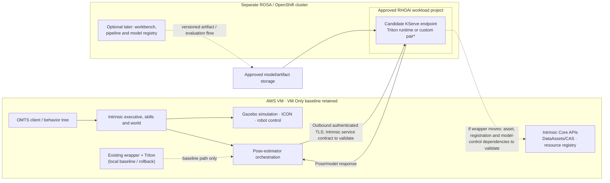

# Tried and set aside: AWS VM + RHOAI (Hybrid)

**Status:** hybrid approach stopped; full OpenShift deployment is the selected
direction. This directory is a historical record, not an active deployment
runbook. On dev01, the UI-created gRPC model became Ready and internal inference
passed through a local port-forward. From the AWS VM, DNS and TLS to its
token-authenticated route worked, but HTTP/2 (`h2`) was not negotiated, so
external gRPC inference did not pass. A custom-certificate change to the
RHOAI-managed route was not retained, and no supported durable configuration
was established. REST inference from the AWS VM and the required client
adaptation were not validated end to end. The OpenShift-specific records below
preserve the experiment details; dev02 results do not count as dev01 evidence.

## Goal

The experiment tested whether the existing Intrinsic simulation on the AWS VM
could use a model-serving endpoint managed through RHOAI on a separate
ROSA/OpenShift cluster. The [VM Only approach](../vm-only/README.md) remains the
working baseline; the active plan is to move the system to OpenShift.

## Proposed responsibility split

| Environment | Initial responsibility | What this means for the pilot |
| --- | --- | --- |
| AWS VM, existing K3s | Intrinsic Core, OMTS executive and skills, simulation/control components, pose-estimator orchestration, `rs-train-service`, and the existing local inference path for baseline/rollback | The VM continues to run the task and simulation. `rs-train-service` currently registers/prepares assets; it is not neural-network training. The pose estimator calls the candidate remote Intrinsic inference resource only when explicitly switched to that path. The moved wrapper may also need approved access back to Core services such as DataAssets/CAS and resource registration. |
| ROSA/OpenShift with RHOAI | First, a model-serving smoke test; then either the listed Triton runtime or a custom paired wrapper/Triton runtime, in an approved RHOAI user project | The target RHOAI/KServe version and model contract determine the integration. Workbench, pipelines, and model registry can support later preparation/evaluation/versioning tests, but are not prerequisites for the first inference call. |

RHOAI operator and platform services remain in the namespaces selected by the
existing RHOAI installation. Pilot serving resources belong in the selected
project `arhkp-intrinsic`, not operator or application system namespaces. If
workbenches, pipelines, or a registry are added, use their configured
user-project and registry namespaces. For the first pilot, only serving is on
the critical path; a workbench, pipeline, and model registry are follow-on
RHOAI capabilities to test after inference compatibility is established.

The existing `rs-inference-service-0` contains an Intrinsic inference wrapper
and Triton sharing model files and a Unix-domain socket. The wrapper currently
targets `unix:///dev/shm/triton.sock:0` and uses shared memory; Triton's model
lifecycle is coordinated by the Intrinsic model controller, with assets tied to
Intrinsic DataAssets/CAS. That is a local process contract, not a remote RHOAI
endpoint contract. Therefore, moving Triton into RHOAI is **not assumed to be a
drop-in change**.

Do not select the final integration pattern yet. First validate the documented
RHOAI serving path with a minimal Triton model, then compare two hypotheses
against the pinned Intrinsic request and model-lifecycle contract:

1. **Custom paired runtime:** keep the wrapper and Triton together in a
   user-maintained RHOAI `ServingRuntime`/`InferenceService`, preserving their
   local socket/shared-memory relationship. Prove that the wrapper speaks the
   protocol exposed by KServe and that the target KServe version supports the
   needed container, health, GPU, and lifecycle behavior. A custom runtime is
   not the same as the listed Tested & Verified Triton runtime.
2. **RHOAI Triton endpoint:** use RHOAI's Triton serving path and adapt the
   Intrinsic client/model lifecycle to network inference. This requires
   replacing local socket/shared-memory assumptions and explicitly mapping
   Intrinsic's dynamic model set, artifact delivery, and load/unload ownership
   to RHOAI's per-model serving resources.

If neither pattern preserves the application contract with an acceptable
support and operations boundary, retain the VM Only inference pair and use RHOAI
Workbench/pipelines for offline evaluation only. The
[full OpenShift plan](../../OPENSHIFT_PLAN.md#71-inference-serving-separate-rhoai-capability-from-intrinsic-integration)
records the same alternatives and prerequisites.

## Implementation issues to resolve

The smoke tests validate a synthetic Triton endpoint, not the complete
Intrinsic-to-RHOAI integration. These are the issues that make the hybrid path
more than changing a service URL:

| Issue | What we know | What remains to resolve |
| --- | --- | --- |
| Intrinsic client contract | The existing wrapper talks to local Triton through a Unix socket and shared memory. | Add or select a remote client path; map tensor names, shapes, data types, outputs, errors, timeouts, and retries. The actual Intrinsic caller and adapter boundary still need confirmation. |
| REST or gRPC transport | On dev01, internal gRPC inference passed; the external route did not negotiate ALPN `h2`. The successful dev02 REST smoke is excluded. | Test a REST-configured runtime and token-authenticated route on dev01. The current gRPC endpoint cannot be switched by changing only the client request. |
| Model and artifact lifecycle | Intrinsic's model controller manages models tied to DataAssets/CAS; RHOAI single-model serving creates a serving deployment per model. | Decide how RF-DETR and FoundationPose artifacts are staged, versioned, authorized, updated, and mapped to RHOAI deployments. Define who owns load/unload and cleanup. |
| Cross-environment access and identity | The dev01 AWS VM resolves and reaches the route over TLS; no end-to-end authorized inference has passed. Dev02 token-auth results are excluded, and source-network allowlisting is untested. | Confirm the accepted ingress policy, least-privilege service identity, token delivery/rotation, and end-to-end REST/TLS behavior on dev01. |
| GPU capacity and cost | The CIFAR-10 smoke reserved a GPU but the sample model itself ran on CPU. VM and cluster GPUs are separate pools. | Test the actual perception models on the target accelerator; size VRAM, replicas, quotas, scheduling, and the cost of keeping both local fallback and remote serving available. |
| Performance and failure behavior | Only synthetic single-request inference is validated. | Measure realistic image payload size, end-to-end latency and throughput; set timeout/retry behavior and verify safe fallback to local inference when the remote endpoint is unavailable. |
| Support and ownership | RHOAI lists NVIDIA Triton as tested and verified; that does not validate the Intrinsic wrapper or this integration. | Confirm the target release's support boundary, who maintains the runtime/image and endpoint, and which team owns incidents and upgrades. |

REST was identified as a possible transport because it avoids the external
gRPC/HTTP/2 route dependency, but it was not validated from the AWS VM and would
still require client and model-lifecycle integration work. RHOAI documentation
lists REST as an additional Triton protocol. See the [RHOAI inference
guide](https://docs.redhat.com/en/documentation/red_hat_openshift_ai_self-managed/3.4/html/deploying_models/making_inference_requests_to_deployed_models)
and [supported configurations](https://access.redhat.com/articles/rhoai-supported-configs-3.x).
These 3.4 docs are version-specific references from the dev02 investigation;
use documentation for the selected cluster's release for any future work.

## High-level collaboration

`*` The RHOAI 3.4.1 inventory was from dev02 only and is not evidence about
dev01. Its support matrix lists NVIDIA Triton as Tested and verified in Standard (Raw) mode,
with gRPC as the default protocol and REST as an additional protocol. The matrix
places it in a separate Tested and verified category, outside the Supported
model-serving runtimes table. Confirm the applicable support scope for the
target version and intended use. This entry does not cover the Intrinsic
wrapper, a custom paired runtime, or this integration. The dev02 runtime
inventory and UI behavior are historical only; inspect dev01's runtime list
and release-specific requirements before serving tests.

RHOAI's documented single-model serving platform creates a dedicated model
server per model. The current Intrinsic pose configuration uses RF-DETR and
FoundationPose with its own model lifecycle. Test how those models map to
RHOAI-managed services; do not assume one RHOAI service preserves Intrinsic's
dynamic multi-model behavior.

The pilot requires separate GPU capacity in the VM and ROSA cluster while the
local path remains available for comparison and rollback. These GPUs are not
pooled; confirm model VRAM needs, quota, GPU scheduling policy, and the cost of
holding both paths before Gate 0 passes.

## Network and secret boundary

Gate 2 starts with an outbound call from the VM to a narrowly scoped serving
endpoint. A custom paired-runtime pattern may also need ROSA-to-VM calls for
DataAssets/CAS, resource registration, or model control. A remote Triton pattern
has different flows, usually from the VM-side Intrinsic client to the RHOAI
endpoint and approved model storage. Map these patterns separately; do not
assume VM-outbound access alone is sufficient, and do not change VM ingress
rules until the exact service, port, source, DNS, and VPC route are identified
and approved. “Private route” does not by itself connect separate VPCs. If a
public route is considered, require TLS, endpoint authentication, and explicit
review; add source restrictions when required by the agreed policy. A stable VM
address can help with an allowlist if selected, but does not create routing,
authorization, or TLS trust. RHOAI's KServe deployment options separate external
model access from token authentication. The current demo route has both enabled
and was tested with synthetic input; do not infer source allowlisting.
Keep actual addresses and connection material outside this repository.

The dev01 gRPC `InferenceService` has a controller-managed external Route. From
the AWS VM, DNS resolution and TLS certificate validation succeeded, but the
route did not negotiate ALPN `h2`; no external gRPC inference or successful
token-authenticated model request has been verified on dev01. The REST/auth
success recorded for dev02 is out of scope. Re-run all endpoint, exposure, and
authentication checks against dev01 before sending any application input.

OpenShift Routes can carry HTTP/2, but this is conditional on Route and
Ingress Controller configuration. Read-only inventory on dev01 identified
OpenShift `4.20.26`; its InferenceService-owned Route uses `reencrypt`, has no
custom certificate, and redirects insecure HTTP to HTTPS. The cluster and
IngressController HTTP/2 override annotations are unset, so backend HTTP/2
enablement still needs verification. OpenShift 4.20 documents that client-side
HTTP/2 ALPN requires a custom, non-wildcard Route certificate. For a re-encrypt
Route, backend HTTP/2 also requires HTTP/2 enabled on the Ingress Controller
and `h2` negotiated by the backend. See [Route TLS configuration](https://docs.redhat.com/en/documentation/openshift_container_platform/4.20/html/network_apis/route-route-openshift-io-v1)
and [HTTP/2 on Ingress Controllers](https://docs.redhat.com/en/documentation/openshift_container_platform/4.20/html/networking_operators/configuring-ingress).

A short-lived certificate was generated outside the repository and stored in a
TLS Secret with router access scoped to that Secret. The Route API accepted a
Secret-reference patch, but the InferenceService-owned Route did not retain it;
an external TLS probe therefore still failed certificate validation. The
temporary Secret and router Role/RoleBinding were removed, and the Route has no
custom certificate. The reason the controller did not retain the patch is not
yet known. A supported way to configure the RHOAI-managed Route, or a separate
Route that preserves token authentication, must be established before retrying.

Treat transport and caller authentication as separate controls: configure TLS
and leave certificate verification enabled, then require endpoint
authentication. The dev02 RHOAI 3.4 model deployment workflow offered an external
`Model access` route and `Require token authentication` for a selected service
account. The dev02 smoke deployment showed the model controller honoring its
`security.opendatahub.io/enable-auth` annotation and
`networking.kserve.io/visibility=exposed` label, creating an admitted HTTPS
reencrypt Route. This is historical behavior, not validated on dev01. The
[test plan](TEST_PLAN.md#required-external-route-authentication-check) describes
checks to repeat on dev01. The AWS VM must use a fresh short-lived token stored
in a protected runtime file; never put the token value in `.env`, shell history,
logs, manifests, or Git.

For the first pilot, prefer a dedicated service-account bearer token with only
the access needed for this inference endpoint, using the platform's supported
token-authentication flow. A bearer token is itself a secret: store it in a
secret manager or protected runtime file and rotate it; do not put its value in
`.env`, shell history, logs, manifests, or Git. OAuth2 client credentials are
an alternative only when an approved identity provider or gateway is
configured to validate the client and issue/accept tokens; a Route does not
implement that flow by itself. Mutual TLS would require a compatible TLS
termination and backend configuration, which the current HTTP Triton service
does not establish.

The committed [`.env.sample`](.env.sample) records the planned VM-side
configuration names with non-routable placeholders and file paths for secret
material. Copy it to `.env` for local values; `.env` and `.env.*` are ignored
by Git. The existing bootstrap and smoke-test scripts do not load dotenv, so
this is a configuration template until the eventual VM-side client is
implemented.

On dev01, a `grpc-v2` InferenceService proves Triton gRPC metadata, readiness,
and inference internally through a temporary localhost-only port-forward, with
output shape `[1, 10]`. The external route reached from the AWS VM did not
negotiate ALPN `h2`, so external gRPC is not proven. REST inference and token
authentication from the VM remain to be tested on dev01; the successful dev02
REST result is explicitly excluded. After the dev01 REST smoke passes, validate
the Intrinsic client contract, then stage the actual RF-DETR/FoundationPose
artifacts under an approved model-storage and licensing path. Keep the local
inference pair as the rollback baseline while comparing identical simulation
inputs. RHOAI documents both Triton REST and gRPC endpoint forms in its
[model deployment guide](https://docs.redhat.com/en/documentation/red_hat_openshift_ai_self-managed/3.4/html/deploying_models/making_inference_requests_to_deployed_models).

Use a workload-scoped identity and only the application-serving permissions
needed for the test; the VM does not need a ROSA cluster-admin kubeconfig.
Inject credentials and trust material through the approved secret/certificate
mechanism at run time. Do not commit secrets, raw kubeconfigs, tokens, private
keys, certificates, endpoint URLs, personal data, or unredacted request/response
logs.

## Outcome

The hybrid approach was set aside because its external gRPC path did not pass,
the controller-managed Route did not retain the attempted custom-certificate
change, and REST/client adaptation remained unvalidated. Full OpenShift is the
selected direction; use [the full OpenShift work plan](../../OPENSHIFT_PLAN.md)
for current planning. Treat this hybrid material as experiment history rather
than instructions to resume the cross-environment path.

## Evidence and references

The topology is a proposal based on the current [VM deployment journal](../../README.md)
and [pod inventory](../../PODS_README.md).
The following product documentation was checked on 2026-10-01 during the dev02
investigation; it is a reference only until dev01's installed release is
confirmed:

- [RHOAI 3.4 model-serving platform](https://docs.redhat.com/en/documentation/red_hat_openshift_ai_self-managed/3.4/html/configuring_your_model-serving_platform/configuring_model_servers)
- [RHOAI 3.4 model deployment](https://docs.redhat.com/en/documentation/red_hat_openshift_ai_self-managed/3.4/html/deploying_models/deploying_models)
- [RHOAI 3.x supported configurations](https://access.redhat.com/articles/rhoai-supported-configs-3.x)
- [AWS ROSA infrastructure security and networking](https://docs.aws.amazon.com/rosa/latest/userguide/infrastructure-security.html)
- [AWS ROSA customer and Red Hat responsibilities](https://docs.aws.amazon.com/rosa/latest/userguide/rosa-responsibilities.html)

For ordered checks and pass criteria, see the [test plan](TEST_PLAN.md). The
isolated file layout is in [implementation layout](IMPLEMENTATION_LAYOUT.md).
